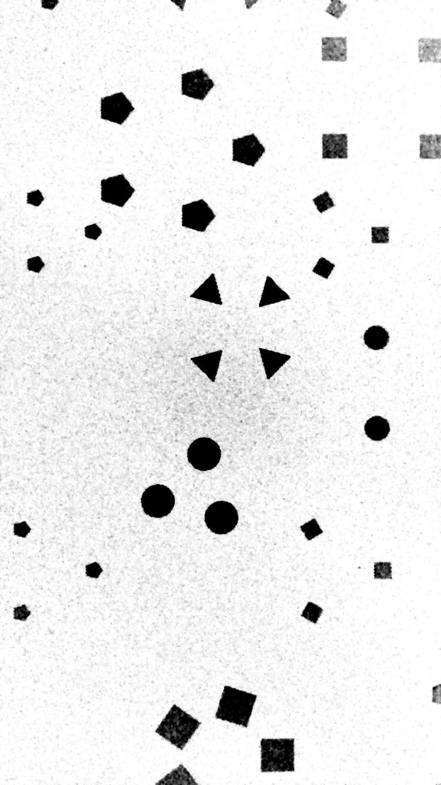
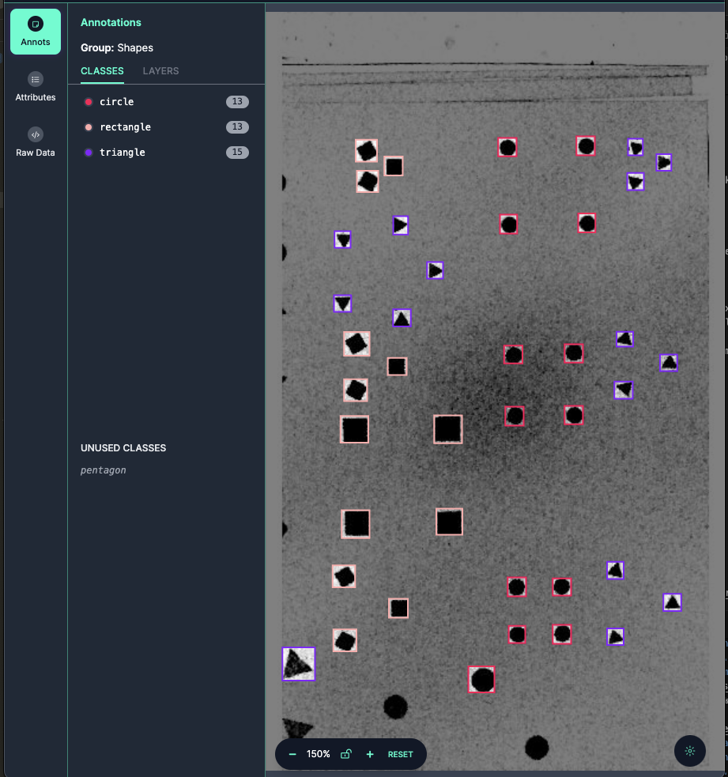
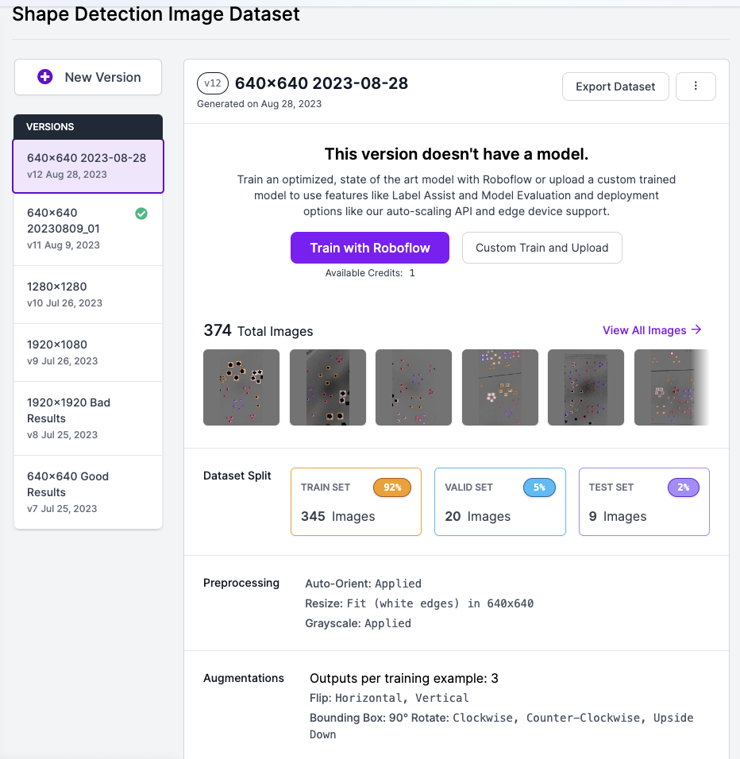
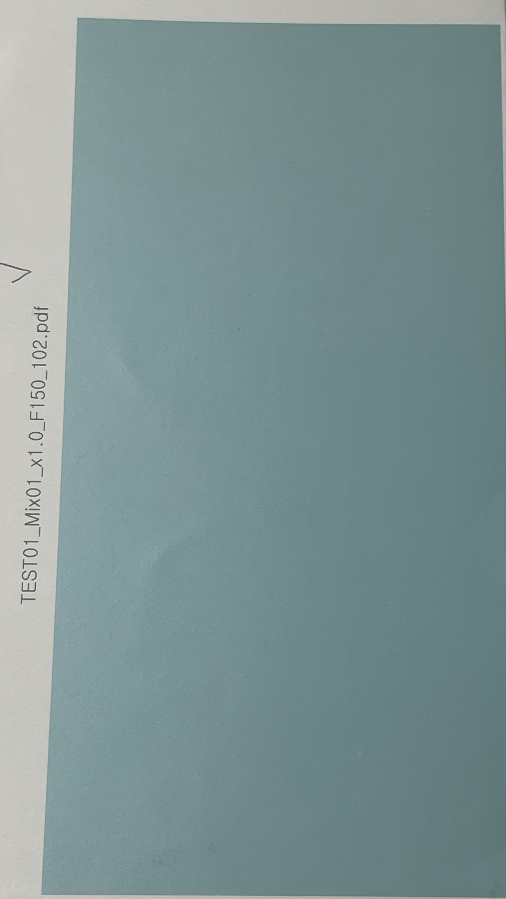
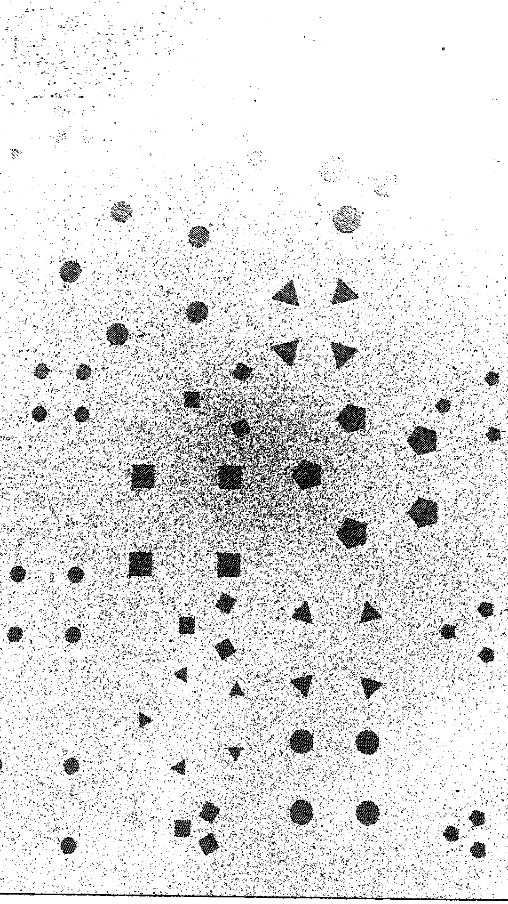
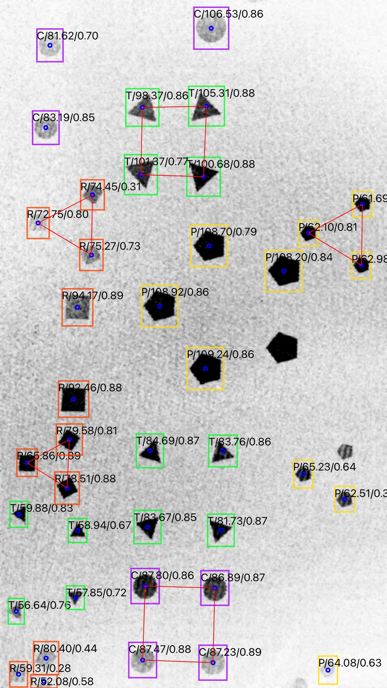
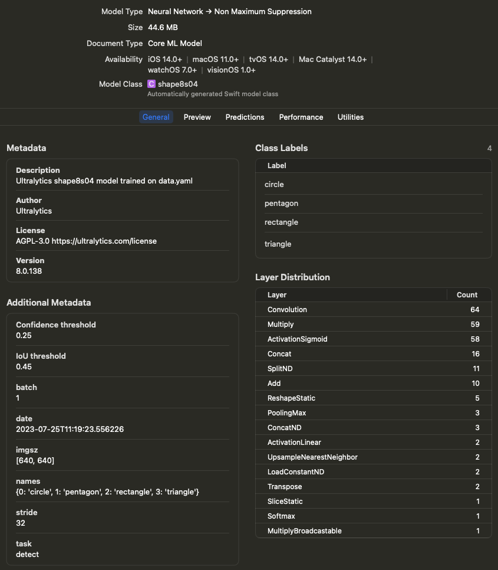

## Shape Detection - iOS

Taking image input from the iPhone Camera, we utilized GPUImage/OpenCV libraries for image processing to visualize the images. We proceeded with training using the yolov8 ML model and converted it into a CoreML model to display recognition results on the iPhone.



## Model - [yolov8](https://docs.ultralytics.com/)

As of mid 2023, yolov8 was the best real-time object detection and image segmentation model. That's the reason why I choose yolov8 for this project.

### Prepare Dataset - [Roboflow](https://universe.roboflow.com/heungwook-song-uirnp/shape-detection-i522t/model/11)

I used Roboflow service for data labeling and augmentation. 

* Data Labeling



* Data Augmentation




### Training

- Install Python
  > https://www.python.org/downloads/windows/

- ensurepip
  
   Python comes with an ensurepip module[1], which can install pip in a Python environment.

  > PS Y:\AI_ML>  py -m ensurepip --upgrade

  More details about how ensurepip works and how it can be used, is available in the standard library documentation.

- pip
  > PS Y:\AI_ML> py -m pip install --upgrade pip

- Install PyTorch with CUDA 12.1 Support
  > PS Y:\AI_ML> pip3 install --pre torch torchvision torchaudio --index-url https://download.pytorch.org/whl/nightly/cu121

- Train : device=0 for GPU
  > PS Y:\AI_ML\ShapeDetection\Train_Test01> yolo task=detect mode=train model=yolov8s.pt data=./data.yaml device=0 epochs=100 imgsz=640

- Test Prediction
  > PS Y:\AI_ML\ShapeDetection> yolo detect predict model=Y:\AI_ML\ShapeDetection\Train_Test01\runs\detect\train2\weights\best.pt source=Y:\AI_ML\ShapeDetection\ShapeData1\*.JPG

- Install Core ML Tools V7.0b1 -> 
-> Problem: in case "nms=True" got error => CoreML: export failure  86.3s: 'NoneType' object is not callable
  > PS Y:\AI_ML\ShapeDetection> pip install coremltools==7.0b1

- Convert .pt to .mlmodel : Edit and run conv_pt2coreml.py

```
from ultralytics import YOLO

model=YOLO('ShapeDetectionM300_1280_01.pt')

model.export(format='coreml',nms=True)
```


## iOS App - Swift / Storyboard

* Images from the camera were processed with GPUImage / OpenCV and detected with Vision Framework(CoreML).

### Image Processing / GPUImage V2 and OpenCV 3.4

* The original image contains hidden shapes that are imperceptible to the human eye, and the GPUImage filter reveals these hidden shapes. 

* Original Image
 

* Processed by GPUImage/OpenCV


* CoreML Detection Result

Labels on each Shape

|Type|Size|Score|
|----|----|-----|
|T: Triangle|Number of Pixels Occupied|Confidence Score: 0.0 ~ 1.0|
|R: Rectangle| | |
|P: Pentagon| | |
|C: Circle| | |



### CoreML / Vision Framework

* Add CoreML model file to project



* Setup CoreML 

```
    func setUpModel() {
        guard let objectDectectionModel = objectDectectionModel else { fatalError("fail to load the model") }
        if let visionModel = try? VNCoreMLModel(for: objectDectectionModel.model) {
            self.visionModel = visionModel
            request = VNCoreMLRequest(model: visionModel, completionHandler: visionRequestDidComplete)
            request?.imageCropAndScaleOption = .scaleFill
        } else {
            fatalError("fail to create vision model")
        }
    }

```

* Post-Processing

```

    func visionRequestDidComplete(request: VNRequest, error: Error?) {
        if let predictions = request.results as? [VNRecognizedObjectObservation] {
//            print(predictions.first?.labels.first?.identifier ?? "nil")
//            print(predictions.first?.labels.first?.confidence ?? -1)
            
            self.predictions = predictions
            DispatchQueue.main.async {
                //self.boxesView.predictedObjects = predictions
                //self.labelsTableView.reloadData()

                if let imageSrc = self.imageAfterOpenCV {
                    
                    let processor = ShapeProcessor(predictions: self.predictions, imageSrc: imageSrc)
                    self.openCVIV.image = processor.imageOut
                    var detectedCode = processor.resultCode
                    
                    if detectedCode != "NONE" {
                        if detectedCode == "S3_M4" || detectedCode == "S4_MC" || detectedCode == "S4_M5" || detectedCode == "S4_M3" || detectedCode == "S3_MC" || detectedCode == "S3_M5" || detectedCode == "S3_M3" || detectedCode == "S4_M4" { // 8
                            self.workDispatch?.cancel()
                            let resultVC =  self.storyboard?.instantiateViewController(withIdentifier: "ResultVC") as! ResultVC
                            resultVC.resultCode = detectedCode
                            resultVC.modalPresentationStyle = .fullScreen
                            self.present(resultVC, animated: false, completion: nil)
                            self.initTimeout()
                            
                        }
                    }
                    //
                    if (self.saveImageFlag) {
                        if let imgOut = processor.imageOut {
                            UIImageWriteToSavedPhotosAlbum(imgOut, nil, nil, nil)

                            let saveOkayVC : SaveConfirmVC = self.storyboard?.instantiateViewController(withIdentifier: "saveComplete") as! SaveConfirmVC
                            self.navigationController?.modalPresentationStyle = UIModalPresentationStyle.currentContext
                            self.present(saveOkayVC, animated: false, completion: nil)
                        }
                    }
                    self.saveImageFlag = false;
                    //self.prepareContourArray(predictions: self.predictions, imageSize: imageSrc.size)
                    //var imageDst = self.drawBoxs(imageSrc: imageSrc)
                    //self.openCVIV.image = self.drawShapeInfo(imageSrc: imageDst)
                }

                self.isInferencing = false
            }
        } else {
            // end of measure
            
            self.isInferencing = false
        }
        self.semaphore.signal()
    }

```



