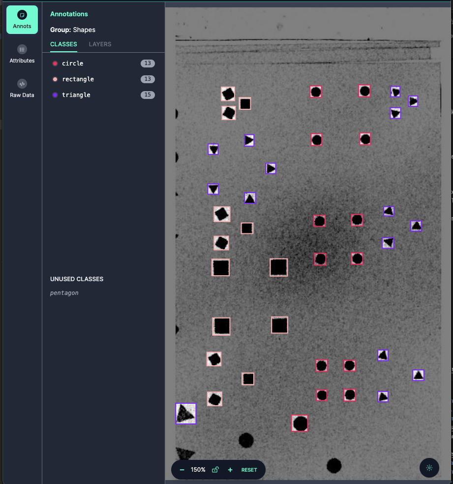
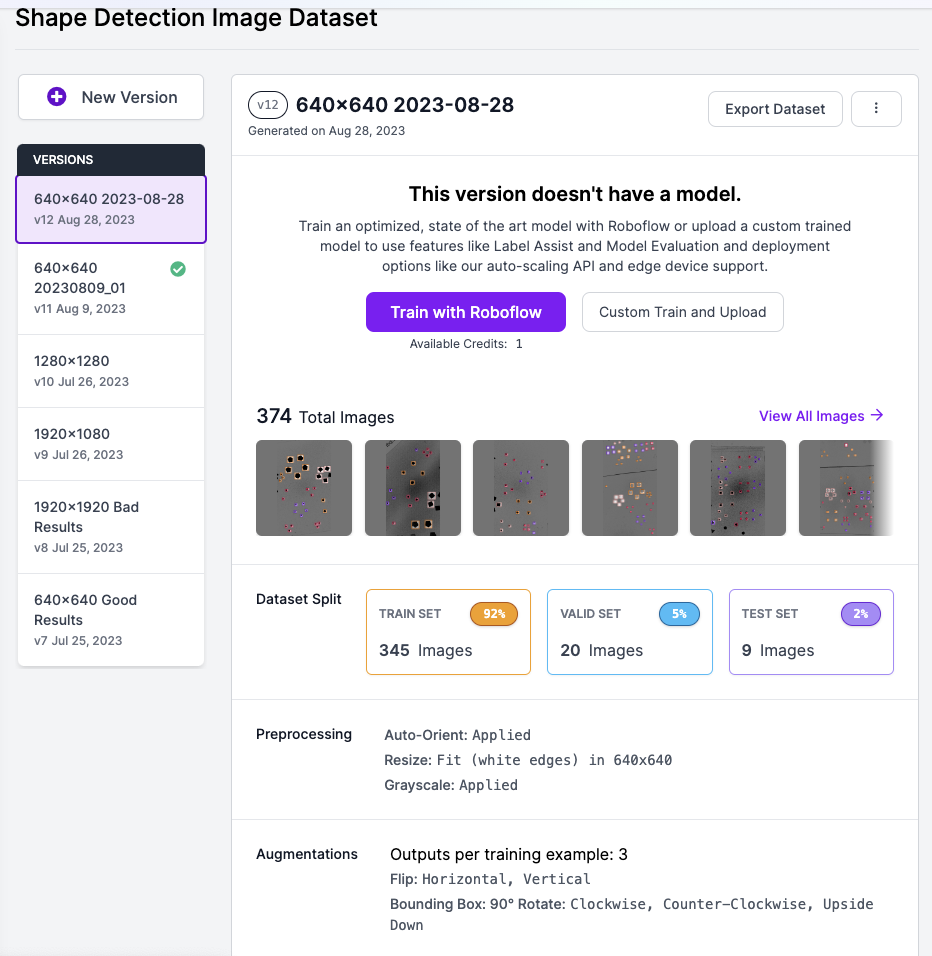
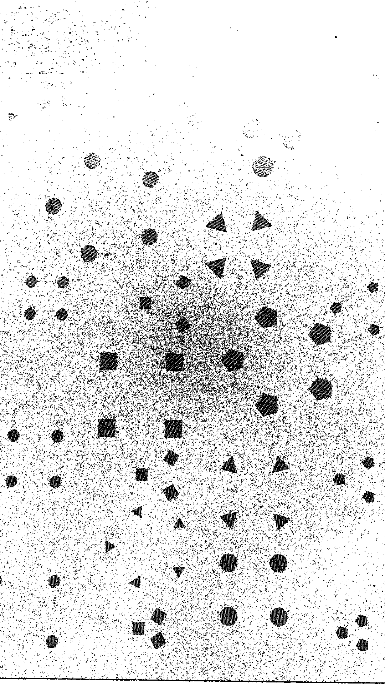
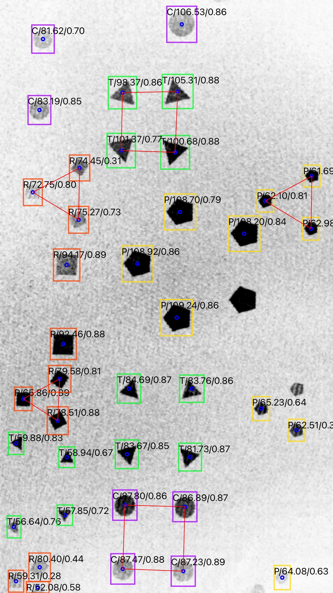
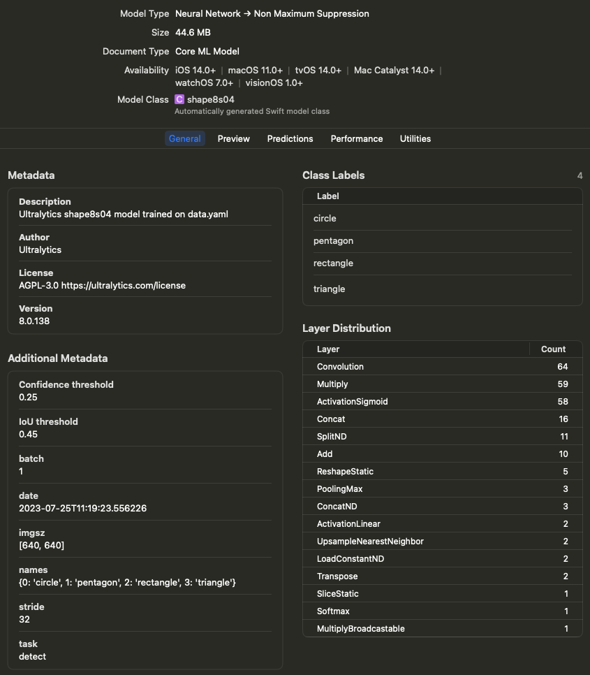

## Shape Detection - iOS

아이폰 카메라에서 이미지 입력을 받아 GPUImage/OpenCV 라이브러리를 사용하여 이미지 처리를 하고 이미지를 시각화했습니다. yolov8 ML 모델을 사용하여 Machine Learning Traning을 진행하고 이를 CoreML 모델로 변환하여 아이폰에서 인식 결과를 표시함.

## Model - [yolov8](https://docs.ultralytics.com/)

yolov8 모델을 사용한 이유는 2023년 중반을 기준으로 yolov8이 실시간 Realtime Object Detection에 가장 적합한 모델이었음.

### Prepare Dataset - [Roboflow](https://universe.roboflow.com/heungwook-song-uirnp/shape-detection-i522t/model/11)

data labeling 과 augmentation 은 Roboflow의 Web-Based Image Data Labeling 기능과 Data Augmentation 기능을 사용함 

* Data Labeling

Roboflow의 Web-Based Data Labeling 화면



* Data Augmentation

Data Augmentation 기능으로 DataSet의 양을 3 ~ 10배 증가 시킴




### Training

- 파이썬 설치
  > https://www.python.org/downloads/windows/

- ensurepip
  > PS Y:\AI_ML>  py -m ensurepip --upgrade


- pip
  > PS Y:\AI_ML> py -m pip install --upgrade pip

- Install PyTorch with CUDA 12.1 Support
  > PS Y:\AI_ML> pip3 install --pre torch torchvision torchaudio --index-url https://download.pytorch.org/whl/nightly/cu121

- Train : device=0 for GPU
  > PS Y:\AI_ML\ShapeDetection\Train_Test01> yolo task=detect mode=train model=yolov8s.pt data=./data.yaml device=0 epochs=100 imgsz=640

- Test Prediction
  > PS Y:\AI_ML\ShapeDetection> yolo detect predict model=Y:\AI_ML\ShapeDetection\Train_Test01\runs\detect\train2\weights\best.pt source=Y:\AI_ML\ShapeDetection\ShapeData1\*.JPG

- Install Core ML Tools V7.0b1 -> 
-> Problem: in case "nms=True" got error => CoreML: export failure  86.3s: 'NoneType' object is not callable
  > PS Y:\AI_ML\ShapeDetection> pip install coremltools==7.0b1

- Convert .pt to .mlmodel : Edit and run conv_pt2coreml.py

```
from ultralytics import YOLO

model=YOLO('ShapeDetectionM300_1280_01.pt')

model.export(format='coreml',nms=True)
```


## iOS App - Swift / Storyboard

* iOS App은 Swift Language를 사용하였으며, UI Design은 Storyboard를 사용하였다. GPUImage/OpenCV를 이용하여 숨겨진 Shape을 드러나도록 하며, CoreML/Vision Framework를 이용하여 Shape을 인식한다.

### Image Processing / GPUImage V2 and OpenCV 3.4

* The original image contains hidden shapes that are imperceptible to the human eye, and the GPUImage filter reveals these hidden shapes. 

* Original Image : Shapes are hidden and 

 

* Processed by GPUImage/OpenCV



* CoreML Detection Result

Labels on each Shape

|Type|Size|Score|
|----|----|-----|
|T: Triangle|Number of Pixels Occupied|Confidence Score: 0.0 ~ 1.0|
|R: Rectangle| | |
|P: Pentagon| | |
|C: Circle| | |



### CoreML / Vision Framework

* Add CoreML model file to project



* Setup CoreML 

```
    func setUpModel() {
        guard let objectDectectionModel = objectDectectionModel else { fatalError("fail to load the model") }
        if let visionModel = try? VNCoreMLModel(for: objectDectectionModel.model) {
            self.visionModel = visionModel
            request = VNCoreMLRequest(model: visionModel, completionHandler: visionRequestDidComplete)
            request?.imageCropAndScaleOption = .scaleFill
        } else {
            fatalError("fail to create vision model")
        }
    }

```

* Post-Processing

```

    func visionRequestDidComplete(request: VNRequest, error: Error?) {
        if let predictions = request.results as? [VNRecognizedObjectObservation] {
//            print(predictions.first?.labels.first?.identifier ?? "nil")
//            print(predictions.first?.labels.first?.confidence ?? -1)
            
            self.predictions = predictions
            DispatchQueue.main.async {
                //self.boxesView.predictedObjects = predictions
                //self.labelsTableView.reloadData()

                if let imageSrc = self.imageAfterOpenCV {
                    
                    let processor = ShapeProcessor(predictions: self.predictions, imageSrc: imageSrc)
                    self.openCVIV.image = processor.imageOut
                    var detectedCode = processor.resultCode
                    
                    if detectedCode != "NONE" {
                        if detectedCode == "S3_M4" || detectedCode == "S4_MC" || detectedCode == "S4_M5" || detectedCode == "S4_M3" || detectedCode == "S3_MC" || detectedCode == "S3_M5" || detectedCode == "S3_M3" || detectedCode == "S4_M4" { // 8
                            self.workDispatch?.cancel()
                            let resultVC =  self.storyboard?.instantiateViewController(withIdentifier: "ResultVC") as! ResultVC
                            resultVC.resultCode = detectedCode
                            resultVC.modalPresentationStyle = .fullScreen
                            self.present(resultVC, animated: false, completion: nil)
                            self.initTimeout()
                            
                        }
                    }
                    //
                    if (self.saveImageFlag) {
                        if let imgOut = processor.imageOut {
                            UIImageWriteToSavedPhotosAlbum(imgOut, nil, nil, nil)

                            let saveOkayVC : SaveConfirmVC = self.storyboard?.instantiateViewController(withIdentifier: "saveComplete") as! SaveConfirmVC
                            self.navigationController?.modalPresentationStyle = UIModalPresentationStyle.currentContext
                            self.present(saveOkayVC, animated: false, completion: nil)
                        }
                    }
                    self.saveImageFlag = false;
                    //self.prepareContourArray(predictions: self.predictions, imageSize: imageSrc.size)
                    //var imageDst = self.drawBoxs(imageSrc: imageSrc)
                    //self.openCVIV.image = self.drawShapeInfo(imageSrc: imageDst)
                }

                self.isInferencing = false
            }
        } else {
            // end of measure
            
            self.isInferencing = false
        }
        self.semaphore.signal()
    }

```


## GPUImage / OpenCV Image Operation

Hidden shapes are invisible with human eyes, and those will be converted with the filters below to be visible.

### Filters Applied

```

if (configType == 7) {
    camera = try Camera(sessionPreset: .hd1920x1080)
    prewittEdge[0].edgeStrength = 0.7
    closing[0].radius = 1
    gaussianBlur[0].blurRadiusInPixels = 1
    erosion[0].radius = 1
    
    camera --> prewittEdge[0] --> closing[0] --> colorInversion[0] --> gaussianBlur[0] --> erosion[0] --> openCVBuf
    camera --> renderView
    desiredZoomFactor = 1.6
}

```

### GPUImage Custom Filter for interoperability with CoreML/OpenCV

```

import CoreGraphics

#if canImport(UIKit)
import UIKit
#else
import Cocoa
#endif

import AVFoundation
import Vision

public class OpenCVBuffer: ImageProcessingOperation {
    public var bufferSize:UInt = 1
    public var activatePassthroughOnNextFrame = true
    
    public let maximumInputs:UInt = 1
    public let targets = TargetContainer()
    public let sources = SourceContainer()
    var bufferedFramebuffers = [Framebuffer]()
    var imageFramebuffer:Framebuffer!
    var hasProcessedImage:Bool = false
    public var imageAvailableCallback:((UIImage) -> UIImage)?


    public init() {
    }
    
    
    public func newFramebufferAvailable(_ framebuffer:Framebuffer, fromSourceIndex:UInt) {
        
        if let imageCallback = imageAvailableCallback {
            let cgImageFromBytes = cgImageFromFramebuffer(framebuffer)
            let image = UIImage(cgImage:cgImageFromBytes, scale:1.0, orientation:.up)

            let transmitImage = imageCallback(image)
            let ciImage = CIImage(image: transmitImage)
            if let ciImageSafe = ciImage {
                let ciContext = CIContext(options: nil)
                let cgImage = ciContext.createCGImage(ciImageSafe, from: ciImageSafe.extent)
                if let cgImageSafe = cgImage {
                    //prepareTransmitFrame(image: cgImageSafe)
                }
            }
        }
        
    }
    
    public func prepareTransmitFrame(image:CGImage, smoothlyScaleOutput:Bool = false, orientation:ImageOrientation = .portrait) {
        let widthOfImage = GLint(image.width)
        let heightOfImage = GLint(image.height)
        
        guard((widthOfImage > 0) && (heightOfImage > 0)) else { fatalError("Tried to pass in a zero-sized image") }

        var widthToUseForTexture = widthOfImage
        var heightToUseForTexture = heightOfImage
        var shouldRedrawUsingCoreGraphics = false
        
        let scaledImageSizeToFitOnGPU = GLSize(sharedImageProcessingContext.sizeThatFitsWithinATextureForSize(Size(width:Float(widthOfImage), height:Float(heightOfImage))))
        if ((scaledImageSizeToFitOnGPU.width != widthOfImage) && (scaledImageSizeToFitOnGPU.height != heightOfImage)) {
            widthToUseForTexture = scaledImageSizeToFitOnGPU.width
            heightToUseForTexture = scaledImageSizeToFitOnGPU.height
            shouldRedrawUsingCoreGraphics = true
        }
        
        if (smoothlyScaleOutput) {
            let powerClosestToWidth = ceil(log2(Float(widthToUseForTexture)))
            let powerClosestToHeight = ceil(log2(Float(heightToUseForTexture)))
            
            widthToUseForTexture = GLint(round(pow(2.0, powerClosestToWidth)))
            heightToUseForTexture = GLint(round(pow(2.0, powerClosestToHeight)))
            shouldRedrawUsingCoreGraphics = true
        }
        
        var imageData:UnsafeMutablePointer<GLubyte>!
        var dataFromImageDataProvider:CFData!
        var format = GL_BGRA
        
        if (!shouldRedrawUsingCoreGraphics) {
            if ((image.bytesPerRow != image.width * 4) || (image.bitsPerPixel != 32) || (image.bitsPerComponent != 8))
            {
                shouldRedrawUsingCoreGraphics = true
            } else {
                let bitmapInfo = image.bitmapInfo
                if (bitmapInfo.contains(.floatComponents)) {
                    shouldRedrawUsingCoreGraphics = true
                } else {
                    let alphaInfo = CGImageAlphaInfo(rawValue:bitmapInfo.rawValue & CGBitmapInfo.alphaInfoMask.rawValue)
                    if (bitmapInfo.contains(.byteOrder32Little)) {
                        if ((alphaInfo != CGImageAlphaInfo.premultipliedFirst) && (alphaInfo != CGImageAlphaInfo.first) && (alphaInfo != CGImageAlphaInfo.noneSkipFirst)) {
                                shouldRedrawUsingCoreGraphics = true
                        }
                    } else if ((bitmapInfo.contains(CGBitmapInfo())) || (bitmapInfo.contains(.byteOrder32Big))) {
                        if ((alphaInfo != CGImageAlphaInfo.premultipliedLast) && (alphaInfo != CGImageAlphaInfo.last) && (alphaInfo != CGImageAlphaInfo.noneSkipLast)) {
                                shouldRedrawUsingCoreGraphics = true
                        } else {
                            format = GL_RGBA
                        }
                    }
                }
            }
        }
        
        if (shouldRedrawUsingCoreGraphics) {
            imageData = UnsafeMutablePointer<GLubyte>.allocate(capacity:Int(widthToUseForTexture * heightToUseForTexture) * 4)

            let genericRGBColorspace = CGColorSpaceCreateDeviceRGB()
            
            let imageContext = CGContext(data:imageData, width:Int(widthToUseForTexture), height:Int(heightToUseForTexture), bitsPerComponent:8, bytesPerRow:Int(widthToUseForTexture) * 4, space:genericRGBColorspace,  bitmapInfo:CGImageAlphaInfo.premultipliedFirst.rawValue | CGBitmapInfo.byteOrder32Little.rawValue)
            imageContext?.draw(image, in:CGRect(x:0.0, y:0.0, width:CGFloat(widthToUseForTexture), height:CGFloat(heightToUseForTexture)))
        } else {
            dataFromImageDataProvider = image.dataProvider?.data
#if os(iOS)
            imageData = UnsafeMutablePointer<GLubyte>(mutating:CFDataGetBytePtr(dataFromImageDataProvider))
#else
            imageData = UnsafeMutablePointer<GLubyte>(mutating:CFDataGetBytePtr(dataFromImageDataProvider)!)
#endif
        }
        
        sharedImageProcessingContext.runOperationSynchronously{
            do {
                self.imageFramebuffer = try Framebuffer(context:sharedImageProcessingContext, orientation:orientation, size:GLSize(width:widthToUseForTexture, height:heightToUseForTexture), textureOnly:true)
            } catch {
                fatalError("ERROR: Unable to initialize framebuffer of size (\(widthToUseForTexture), \(heightToUseForTexture)) with error: \(error)")
            }
            
            glBindTexture(GLenum(GL_TEXTURE_2D), self.imageFramebuffer.texture)
            if (smoothlyScaleOutput) {
                glTexParameteri(GLenum(GL_TEXTURE_2D), GLenum(GL_TEXTURE_MIN_FILTER), GL_LINEAR_MIPMAP_LINEAR)
            }
            
            glTexImage2D(GLenum(GL_TEXTURE_2D), 0, GL_RGBA, widthToUseForTexture, heightToUseForTexture, 0, GLenum(format), GLenum(GL_UNSIGNED_BYTE), imageData)
            
            if (smoothlyScaleOutput) {
                glGenerateMipmap(GLenum(GL_TEXTURE_2D))
            }
            glBindTexture(GLenum(GL_TEXTURE_2D), 0)
        }

        if (shouldRedrawUsingCoreGraphics) {
            imageData.deallocate()
        }
    }

    
    
    public func transmitPreviousImage(to target:ImageConsumer, atIndex:UInt) {

    }
    
    func cgImageFromFramebuffer(_ framebuffer:Framebuffer) -> CGImage {
        let renderFramebuffer = sharedImageProcessingContext.framebufferCache.requestFramebufferWithProperties(orientation:framebuffer.orientation, size:framebuffer.size)
        renderFramebuffer.lock()
        renderFramebuffer.activateFramebufferForRendering()
        clearFramebufferWithColor(Color.red)
        renderQuadWithShader(sharedImageProcessingContext.passthroughShader, uniformSettings:ShaderUniformSettings(), vertexBufferObject:sharedImageProcessingContext.standardImageVBO, inputTextures:[framebuffer.texturePropertiesForOutputRotation(.noRotation)])
        framebuffer.unlock()
        
        let imageByteSize = Int(framebuffer.size.width * framebuffer.size.height * 4)
        let data = UnsafeMutablePointer<UInt8>.allocate(capacity: imageByteSize)
        glReadPixels(0, 0, framebuffer.size.width, framebuffer.size.height, GLenum(GL_RGBA), GLenum(GL_UNSIGNED_BYTE), data)
        renderFramebuffer.unlock()
        guard let dataProvider = CGDataProvider(dataInfo:nil, data:data, size:imageByteSize, releaseData: dataProviderReleaseCallback) else {fatalError("Could not allocate a CGDataProvider")}
        let defaultRGBColorSpace = CGColorSpaceCreateDeviceRGB()
        return CGImage(
            width: Int(framebuffer.size.width),
            height: Int(framebuffer.size.height),
            bitsPerComponent: 8,
            bitsPerPixel: 32,
            bytesPerRow: 4 * Int(framebuffer.size.width),
            space: defaultRGBColorSpace,
            bitmapInfo: CGBitmapInfo(rawValue: CGImageAlphaInfo.noneSkipLast.rawValue),
            provider: dataProvider,
            decode:nil, shouldInterpolate:false, intent:.defaultIntent)!
    }

}


```

### GPUImage Custom Filter Callback Method

```

openCVBuf.imageAvailableCallback = {image in
    self.imageAfterOpenCV = image

    DispatchQueue.main.async{
        guard let request = self.request else { fatalError() }
        self.semaphore.wait()
        let handler = VNImageRequestHandler(cvPixelBuffer: image.pixelBufferFromImage())
        try? handler.perform([request])

    }
    return self.imageAfterOpenCV!
}

```



