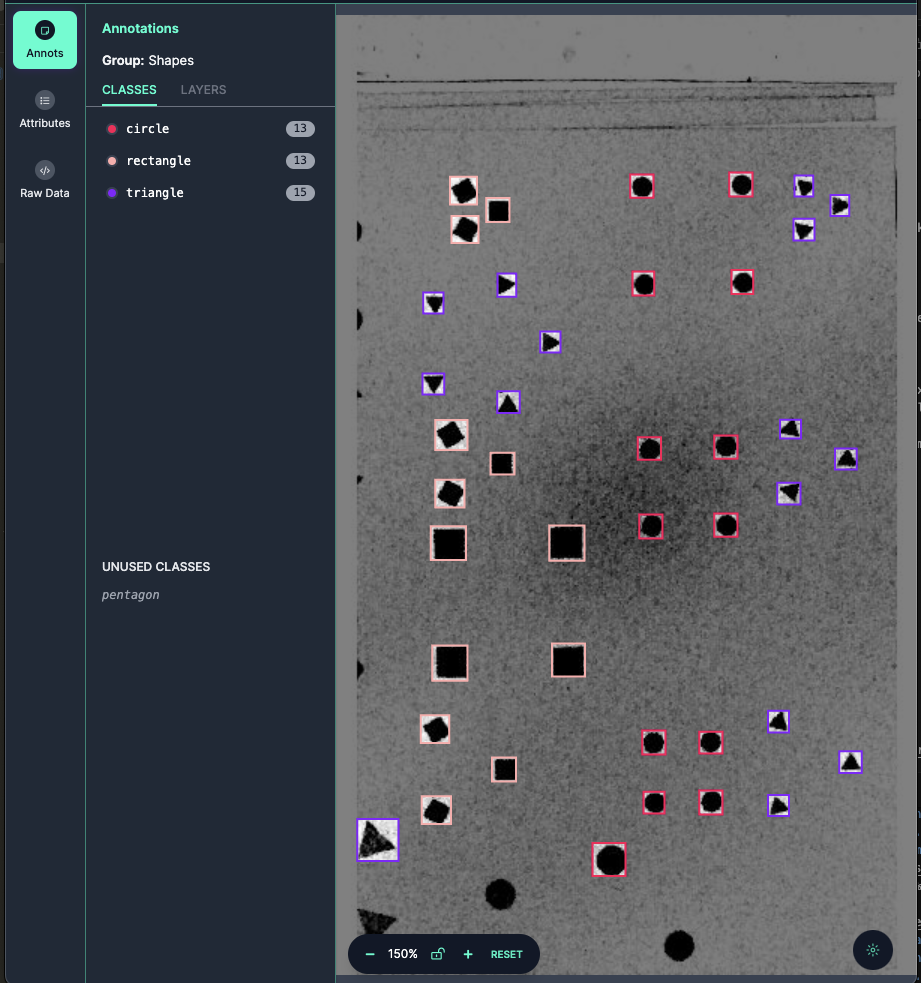
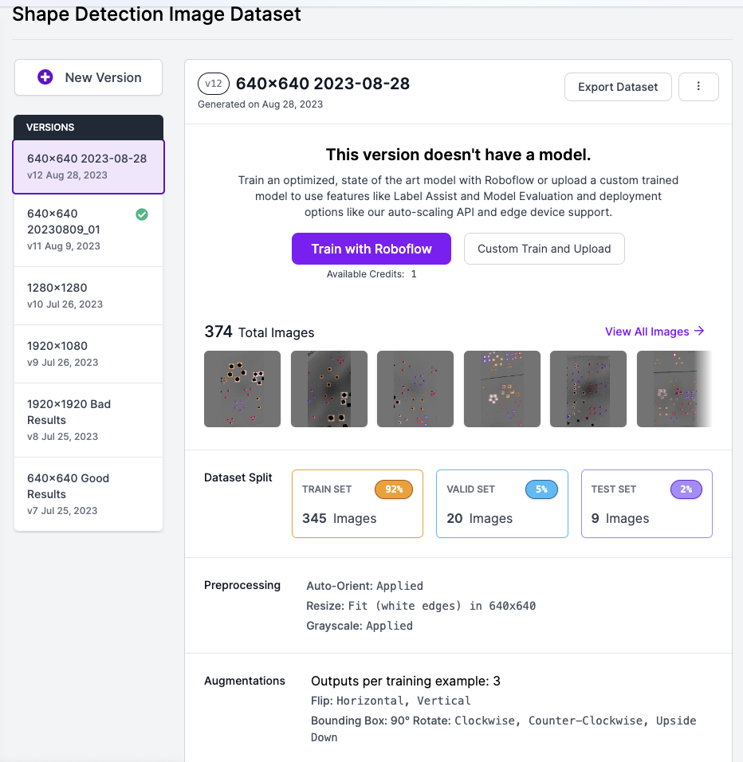

## Machine Learning - Shape Detection


### Prepare Dataset - [Roboflow](https://universe.roboflow.com/heungwook-song-uirnp/shape-detection-i522t/model/11)

Data labeling and augmentation were performed using Roboflow's Web-Based Image Data Labeling feature and Data Augmentation functionality.

* Data Labeling

The Web-Based Data Labeling interface of Roboflow.



* Data Augmentation

Using the Data Augmentation feature, we increased the size of the DataSet by 3 to 10 times.



## Training

### iOS - [yolov8](https://docs.ultralytics.com/)

The reason for using the yolov8 model is that as of mid-2023, yolov8 was considered the most suitable model for real-time object detection.

- Install Python
  > https://www.python.org/downloads/windows/

- ensurepip
  
   Python comes with an ensurepip module[1], which can install pip in a Python environment.

  > PS Y:\AI_ML>  py -m ensurepip --upgrade

  More details about how ensurepip works and how it can be used, is available in the standard library documentation.

- pip
  > PS Y:\AI_ML> py -m pip install --upgrade pip

- Install PyTorch with CUDA 12.1 Support
  > PS Y:\AI_ML> pip3 install --pre torch torchvision torchaudio --index-url https://download.pytorch.org/whl/nightly/cu121

- Train : device=0 for GPU
  > PS Y:\AI_ML\ShapeDetection\Train_Test01> yolo task=detect mode=train model=yolov8s.pt data=./data.yaml device=0 epochs=100 imgsz=640

- Test Prediction
  > PS Y:\AI_ML\ShapeDetection> yolo detect predict model=Y:\AI_ML\ShapeDetection\Train_Test01\runs\detect\train2\weights\best.pt source=Y:\AI_ML\ShapeDetection\ShapeData1\*.JPG

- Install Core ML Tools V7.0b1 -> 
-> Problem: in case "nms=True" got error => CoreML: export failure  86.3s: 'NoneType' object is not callable
  > PS Y:\AI_ML\ShapeDetection> pip install coremltools==7.0b1

- Convert .pt to .mlmodel : Edit and run conv_pt2coreml.py

    ```
    from ultralytics import YOLO

    model=YOLO('ShapeDetectionM300_1280_01.pt')

    model.export(format='coreml',nms=True)
    ```


### Android - Tensorflow Lite / MobileNetV2_320

For the Object Detection App of Android devices, we utilized the most suitable Tensorflow Lite Library along with the MobileNetV2 Model.

- Traning and model conversion had been done on Google Colab using Colab Notebook below. 

    [Colab Notebook - MobileNetV2_TFLite2_ObjectDetection](20230813_MobilenetV2_320_Train_TFLite2_Object_Detction_Model.ipynb)

    When exporting the model to a TF Lite file without specifying the maximum number of recognitions, the number of detections is limited to 10. Therefore, it is essential to include the following option: (100 or the desired maximum number of recognitions).
    > --max_detections 100

    ```python
    # Make a directory to store the trained TFLite model
    #!mkdir /content/drive/MyDrive/mobilenetv2_320/custom_model_lite2
    colab_project_folder = '/content/drive/MyDrive/colab03'
    output_directory = '/content/drive/MyDrive/mobilenetv2_320/custom_model_lite2'

    # Path to training directory (the conversion script automatically chooses the highest checkpoint file)
    last_model_path = '/content/drive/MyDrive/mobilenetv2_320/training'

    !python {colab_project_folder}/models/research/object_detection/export_tflite_graph_tf2.py \
        --trained_checkpoint_dir {last_model_path} \
        --output_directory {output_directory} \
        --max_detections 100 \
        --pipeline_config_path {pipeline_file}
    ```

- TF Lite Quantization

    Convert the exported TF Lite file to a float16 quantization file.

    ```python
    import tensorflow as tf
    converter = tf.lite.TFLiteConverter.from_saved_model(saved_model_dir)
    converter.optimizations = [tf.lite.Optimize.DEFAULT]
    converter.target_spec.supported_types = [tf.float16]
    conv_result = converter.convert()
    with open(tflite_model_dir + '/float16_quant.tflite', 'wb') as f:
    f.write(conv_result)
    ```



