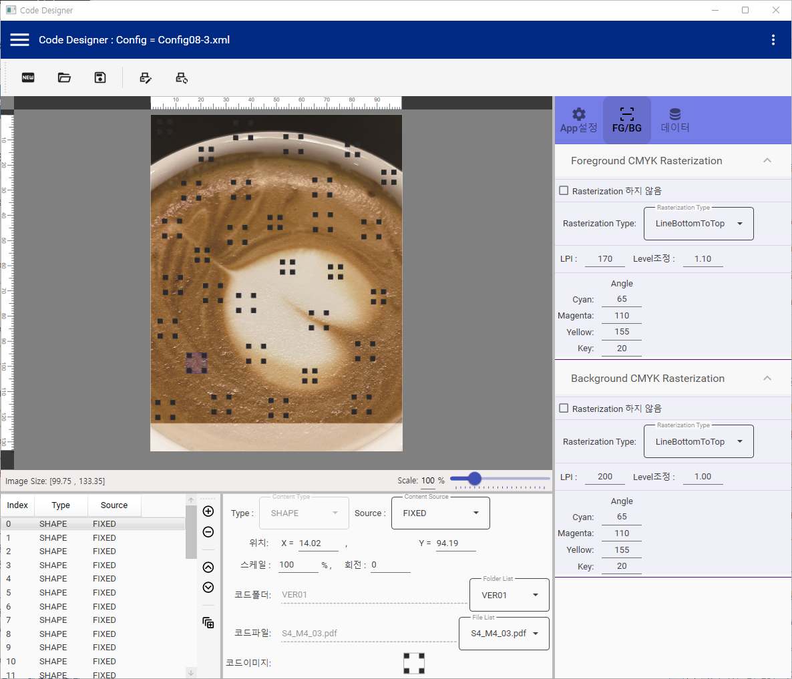

## Shape Designer - .NET 8, WPF-MVVM

A .NET 8 + WPF Desktop Application that positions hidden shapes and executes rasterization in the C/M/Y/K Color Space to generate PDF output.

- Shape Designer 



### MVVM Base Class

For the interaction between UI components and class member properties, inherit the following MVVM Base Class.

```C#
public abstract class ConfigViewModel : INotifyPropertyChanged
{
    public event PropertyChangedEventHandler? PropertyChanged;

    public virtual bool SetProperty<T>(ref T member, T value, [CallerMemberName] string? propertyName = null)
    {
        if (EqualityComparer<T>.Default.Equals(member, value))
            return false;

        member = value;
        OnPropertyChanged(propertyName);
        return true;
    }
    public void OnPropertyChanged([CallerMemberName] string? propertyName = null)
        => PropertyChanged?.Invoke(this, new PropertyChangedEventArgs(propertyName));

    public void PropertiesChanged(params string[] propertyNames)
    {
        foreach (var propertyName in propertyNames)
            OnPropertyChanged(propertyName);
    }

    //
    //

    public void DataContextUpdated(string lsPropertyName, string lsAction, object? loVariable = null)
    {
        if (OnDataContextUpdated == null) return;

        DataContextUpdateEventArgs args = new DataContextUpdateEventArgs(lsPropertyName, lsAction, null);
        OnDataContextUpdated(this, args);
    }

    public delegate void DataContextUpdateHandler(object sender, DataContextUpdateEventArgs e);
    private event DataContextUpdateHandler? OnDataContextUpdated;
    private bool _isDataContextUpdateSubscribed = false;
    public void AddDataContextUpdateHandler(DataContextUpdateHandler handler)
    {
        if (this._isDataContextUpdateSubscribed)
        {
            this._isDataContextUpdateSubscribed = false;
            this.OnDataContextUpdated -= handler;
        }
        this._isDataContextUpdateSubscribed = true;
        this.OnDataContextUpdated += handler;
    }
    public class DataContextUpdateEventArgs : EventArgs
    {
        public string PropertyName { get; private set; }
        public string Action { get; private set; }
        public object? Variable { get; private set; }

        public DataContextUpdateEventArgs(string lsPropertyName, string lsAction, object? loVariable)
        {
            PropertyName = lsPropertyName;
            Action = lsAction;
            Variable = loVariable;
        }

    }

    #region Event Handler : Call Parent Function
    public enum EnumFunction
    {
        // ContentText
        TextDataUpdate,
        // ContentImage
        ImageFileUpdate,
        // ContentShape
        CodeFileUpdate,
        //
        ImgRastCfgLoadAllImages,
        // Common
        UpdateSelection,
        MouseDown,
        MouseUp,
        

    }
    public void CallParentFunction(CallParentFunctionEventArgs e)
    {
        if (OnCallParentFunction == null) return;
        OnCallParentFunction(this, e);
    }

    public delegate void CallParentFunctionHandler(Object child, CallParentFunctionEventArgs e);
    private event CallParentFunctionHandler? OnCallParentFunction;
    private bool _isCallParentFunctionSubscribed = false;
    public void RegisterCallParentFunctionHandler(CallParentFunctionHandler handler)
    {
        if (this._isCallParentFunctionSubscribed)
        {
            this._isCallParentFunctionSubscribed = false;
            this.OnCallParentFunction -= handler;
        }
        this._isCallParentFunctionSubscribed = true;
        this.OnCallParentFunction += handler;
    }
    public class CallParentFunctionEventArgs : EventArgs
    {
        public EnumFunction function { get; private set; }
        public object[]? arguments { get; private set; }

        public CallParentFunctionEventArgs(EnumFunction function, object[]? arguments = null)
        {
            this.function = function;
            this.arguments = arguments;
        }

    }
    #endregion Event Handler : Call Parent Function


    #region Commands

    private DelegateCommand? _CommandHandler;
    public DelegateCommand CommandHandler
    {
        get
        {
            return (this._CommandHandler) ?? (this._CommandHandler = new DelegateCommand(this.ProcessCommand));
        }
    }
    public abstract void ProcessCommand(object? lCmd);


    public class DelegateCommand : ICommand
    {

        private readonly Func<bool> canExecute;
        private readonly Action<object>? execute_p;
        private readonly Action? execute_n;

        /// <summary>
        /// Initializes a new instance of the DelegateCommand class.
        /// </summary>
        /// <param name="execute">indicate an execute function</param>
        public DelegateCommand(Action execute) : this(execute, null)
        {
        }
        public DelegateCommand(Action<object> execute) : this(execute, null)
        {
        }
        /// <summary>
        /// Initializes a new instance of the DelegateCommand class.
        /// </summary>
        /// <param name="execute">execute function </param>
        /// <param name="canExecute">can execute function</param>
        public DelegateCommand(Action execute, Func<bool> canExecute)
        {
            this.execute_n = execute;
            this.canExecute = canExecute;
            this.execute_p = null;
        }
        public DelegateCommand(Action<object> execute, Func<bool> canExecute)
        {
            this.execute_p = execute;
            this.canExecute = canExecute;
            this.execute_n = null;
        }
        /// <summary>
        /// can executes event handler
        /// </summary>
        public event EventHandler? CanExecuteChanged;

        /// <summary>
        /// implement of icommand can execute method
        /// </summary>
        /// <param name="o">parameter by default of icomand interface</param>
        /// <returns>can execute or not</returns>
        public bool CanExecute(object? o)
        {
            if (this.canExecute == null)
            {
                return true;
            }
            return this.canExecute();
        }

        /// <summary>
        /// implement of icommand interface execute method
        /// </summary>
        /// <param name="o">parameter by default of icomand interface</param>
        public void Execute()
        {
            if (this.execute_n != null)
                this.execute_n();
        }
        public void Execute(object? o)
        {
            if (this.execute_p == null)
            {
                if (this.execute_n != null)
                    this.execute_n();
            }
            else
                this.execute_p(o);
        }
        /// <summary>
        /// raise ca excute changed when property changed
        /// </summary>
        public void RaiseCanExecuteChanged()
        {
            if (this.CanExecuteChanged != null)
            {
                this.CanExecuteChanged(this, EventArgs.Empty);
            }
        }
    }

    #endregion Commands
}
```

### Class property getter and setter

- CASE #1, the setter will update its own value(_y) and notify all UI components referencing the class member "y" that it has been updated.
> set { this._y = value; OnPropertyChanged("y"); }

- CASE #2, to make it simple, use SetProperty() method. This will do all at once inside the method.
> set => SetProperty(ref this._type, value);

- CASE #3, also notify to the UI components referencing another class member, use additional OnPropertyChanged("MEMBER NAME").  
> set { SetProperty(ref this._x, value); OnPropertyChanged("borderMargin"); }

- CASE #4, need to give notifications for multiple class members, use PropertiesChanged(string []) method.
> set { SetProperty(ref this._source, value); PropertiesChanged(new string[] { "enableCodeFolderTextBox", "enableCodeFolderComboBox", "enableCodeFileTextBox", "enableCodeFileComboBox" }); }

```C#
public class ContentShape: ConfigViewModel, IContent
{
    //
    // CASE #1
    [DataMember(Name = "y"), OptionalField(VersionAdded = 100)]
    internal double _y;
    public double y
    {
        get => this._y;
        set { this._y = value; OnPropertyChanged("y"); }
    }
    //
    // CASE #2
    [DataMember(Name = "type"), OptionalField(VersionAdded = 100)]
    internal EnumTypes _type;
    public EnumTypes type
    {
        get => this._type;
        set => SetProperty(ref this._type, value);
    }
    //
    // CASE #3
    [DataMember(Name = "x"), OptionalField(VersionAdded = 100)]
    internal double _x;
    public double x
    {
        get => this._x;
        set { SetProperty(ref this._x, value); OnPropertyChanged("borderMargin"); }
    }
    //
    // CASE #4
    [DataMember(Name = "source"), OptionalField(VersionAdded = 100)]
    internal EnumSources _source;
    public EnumSources source
    {
        get => this._source;
        set { SetProperty(ref this._source, value); PropertiesChanged(new string[] {
            "enableCodeFolderTextBox", "enableCodeFolderComboBox", "enableCodeFileTextBox", "enableCodeFileComboBox" }); }
    }
    //

    ....
}
```

### MVVM Xaml, DataContext

Like below, assign model class to DataContext.

```C#
public partial class ContentShapeUC : UserControl
{
    ContentShape config;
    public ContentShapeUC(ContentShape config)
    {
        this.config = config;

        InitializeComponent();

        DataContext = this.config;
    }
}
```

- Binding for number

```XML
<TextBox MinWidth="60" MaxWidth="60" TextAlignment="Left" HorizontalAlignment="Left" VerticalAlignment="Center" Text="{Binding y, UpdateSourceTrigger=PropertyChanged, StringFormat={}{0:0.##} }" ToolTip="Y Position" Cursor="IBeam"  />
```

- Binding for string

```XML
<TextBox Grid.Row="0" Grid.Column="0" TextAlignment="Left" MinWidth="60" HorizontalAlignment="Stretch" VerticalAlignment="Center" Text="{Binding codeFolder, UpdateSourceTrigger=PropertyChanged}" ToolTip="Specify Code Folder" Cursor="IBeam" Margin="4" IsEnabled="{Binding enableCodeFolderTextBox}" />
```

- Binding for Enums-ComboBox

```XML
<UserControl.Resources>
    <ResourceDictionary>
        <ObjectDataProvider x:Key="enumSources" MethodName="GetValues" ObjectType="{x:Type System:Enum}">
            <ObjectDataProvider.MethodParameters>
                <x:Type TypeName="DesignConfig:EnumSources"/>
            </ObjectDataProvider.MethodParameters>
        </ObjectDataProvider>
    </ResourceDictionary>
</UserControl.Resources>
...
<ComboBox x:Name="SourceComboBox" Style="{StaticResource MaterialDesignOutlinedComboBox}" materialDesign:HintAssist.Hint="Content Source" ItemsSource="{Binding Source={StaticResource enumSources}}" SelectedValue="{Binding source, Mode=TwoWay}" />
```

### XAML Command and CommandParameter

- When the button clicks, CommandHandler in MVVM Base Class will be called, and ovridden ProcessCommand() method in model class will process the command. 

```XML
<Button Command="{Binding CommandHandler}" CommandParameter="ImageOpenDialog" Style="{StaticResource MaterialDesignRaisedButton}" FontSize="10" Content="선택" HorizontalAlignment="Right" VerticalAlignment="Center" Padding="8" Height="28" Margin="0,0,10,0"/>
```

```C#
public class ContentImage: ConfigViewModel, IContent
{
    ...
    public override void ProcessCommand(object? lCmd)
    {
        string cmdParam = (lCmd as string) ?? (string.Empty);
        if (cmdParam.Equals("ImageOpenDialog", StringComparison.OrdinalIgnoreCase))
        {
            OpenFileDialog oFDlg = new OpenFileDialog();
            oFDlg.Filter = "Image Files|*.pdf;*.jpg;*.jpeg;*.png;*.bmp|All Files|*.*";

            if (oFDlg.ShowDialog() == true)
            {
                this.imagePath = oFDlg.FileName;
            }
            
        }
    }
    ...
}
```

- In case, the command will interact with UI, the command have to be executed in UI class. To do this, register the command handler in UI class to MVVM Base class.
> this.config.AddDataContextUpdateHandler(DataContextUpdate);

```XML
<Button Command="{Binding CommandHandler}" CommandParameter="SelectOutputFolder" Style="{StaticResource MaterialDesignRaisedButton}" FontSize="10"  Content="선택" HorizontalAlignment="Right" VerticalAlignment="Center" Padding="8" Height="28" Margin="4"/>
```

```C#
public partial class PrintAutoDialog : Window
{
    PrintAutoDialogConfig config;

    public PrintAutoDialog(MainConfig mainConfig)
    {
        this.config = new PrintAutoDialogConfig(mainConfig);
        InitializeComponent();

        DataContext = this.config;

        this.config.AddDataContextUpdateHandler(DataContextUpdate);
    }

    private void DataContextUpdate(object sender, ConfigViewModel.DataContextUpdateEventArgs e)
    {
        if (e.Action.Equals("SelectOutputFolder", StringComparison.OrdinalIgnoreCase))
        {
            using (var dialog = new System.Windows.Forms.FolderBrowserDialog())
            {
                System.Windows.Forms.DialogResult result = dialog.ShowDialog();
                if (result == System.Windows.Forms.DialogResult.OK)
                {
                    this.config.autoOutFolder = dialog.SelectedPath;
                }
            }

        }
    }
}
```

And, ProcessCommand() method in model class, forwards command to registered command handler in the UI class.
> this.DataContextUpdated(string.Empty, lsCmd);

```C#
public class PrintAutoDialogConfig : ConfigViewModel
{
    ...
    public override void ProcessCommand(object? lCmd)
    {
        string lsCmd = (lCmd as string) ?? (string.Empty);
        if (string.IsNullOrEmpty(lsCmd))
            return;
        this.DataContextUpdated(string.Empty, lsCmd);
    }
    ...
}
```


### ObservableCollection for ListView / ListBox

- ListView Xaml

```XML
<ListView Grid.Row="0" Grid.Column="0" x:Name="ProcsLV" SelectedItem="{Binding selectedContent, Mode=TwoWay, UpdateSourceTrigger=PropertyChanged}" IsSynchronizedWithCurrentItem="True" ItemsSource="{Binding contentsOC}" SelectionMode="Single" >
    <ListView.ContextMenu>
        <ContextMenu>
            <MenuItem Header="복사/추가" Command="{Binding CommandHandler}" CommandParameter="SelectedItemCopyAndPaste" />
        </ContextMenu>
    </ListView.ContextMenu>
    <ListView.ItemContainerStyle>
        <Style TargetType="{x:Type ListViewItem}">
            <Style.Triggers>
                <Trigger Property="IsMouseOver" Value="True">
                    <Setter Property="Background" Value="LightGray" />
                </Trigger>
            </Style.Triggers>
        </Style>
    </ListView.ItemContainerStyle>
    <ListView.View>
        <GridView>
            <GridView.ColumnHeaderContainerStyle>
                <Style TargetType="{x:Type GridViewColumnHeader}">
                    <Setter Property="IsEnabled" Value="True"/>
                    <Setter Property="Height" Value="34" />
                </Style>
            </GridView.ColumnHeaderContainerStyle>
            <GridViewColumn Header="Index" Width="50"
                DisplayMemberBinding="{Binding RelativeSource={RelativeSource FindAncestor, AncestorType={x:Type ListViewItem}}, Converter={StaticResource IndexConverter}}" />
            <GridViewColumn Width="80" DisplayMemberBinding="{Binding type}" Header="Type" />
            <GridViewColumn Width="80" DisplayMemberBinding="{Binding source}" Header="Source" />
            
        </GridView>
    </ListView.View>
</ListView>
```

- ObservableCollection in the code below interacts with ListView in Xaml.

```C#
public class ContentsViewModel : ConfigViewModel
{
    private List<IContent> _contents;
    public List<IContent> contents
    {
        get => this._contents;
        set => SetProperty(ref this._contents, value);
    }
    //
    private ObservableCollection<IContent> _contentsOC;
    public ObservableCollection<IContent> contentsOC
    {
        get => this._contentsOC;
        set => SetProperty(ref this._contentsOC, value);
    }
    //

    public IContent? selectedContent
    {
        get => this.GetSelectedContent();
        set
        {
            this.SetSelectedValue(value);
            this.ucContent = IContent.GetControl(value);
            OnPropertyChanged("selectedContent");
        }
    }
    public IContent? GetSelectedContent()
    {
        return this.contents.Find(content => content.selected);
    }
    private void SetSelectedValue(IContent value)
    {
        if (this.contents != null)
            this.contents.ForEach(content => content.selected = (content.Equals(value)));
    }
    //
    //
    private UserControl? _ucContent;
    public UserControl? ucContent
    {
        get => this._ucContent;
        set => SetProperty(ref this._ucContent, value);
    }
    //
    //
    [NonSerialized]
    private EnumTypes _selectedContentType;
    public EnumTypes selectedContentType { get => this._selectedContentType; set => this._selectedContentType = value; }
    //
    public ContentsViewModel(List<IContent> contents)
    {
        this._contents = contents;
        this._contentsOC = new ObservableCollection<IContent>();
        InitOC();
        this._ucContent = null;
    }

    public override void ProcessCommand(object? lCmd)
    {
        string lsCmd = (lCmd as string) ?? (string.Empty);

        this.DataContextUpdated("ContentsViewModel", lsCmd);
    }

    public void InitOC()
    {
        this.contentsOC = new ObservableCollection<IContent>();
        if (this.contents != null && this.contents.Count > 0)
        {
            foreach (var cnt in this.contents)
                this.contentsOC.Add(cnt);
        }
        OnPropertyChanged("contentsOC");
    }

    public int GetSelectedIndex()
    {
        int index = -1;
        if (selectedContent != null)
            index = this.contentsOC.IndexOf(selectedContent);
        return index;
    }
}
```



