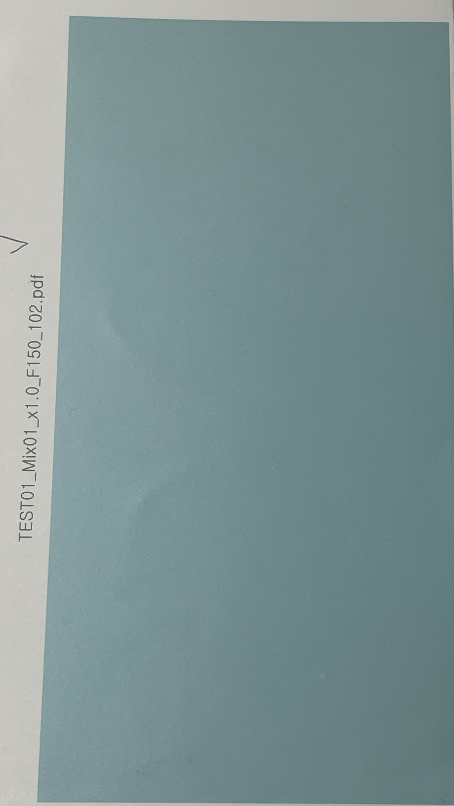
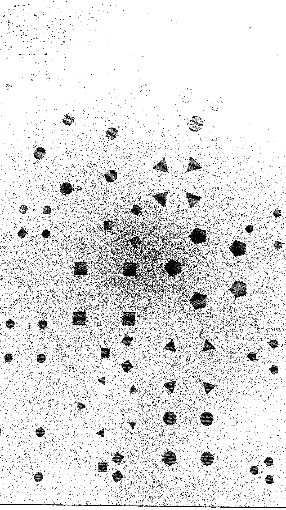
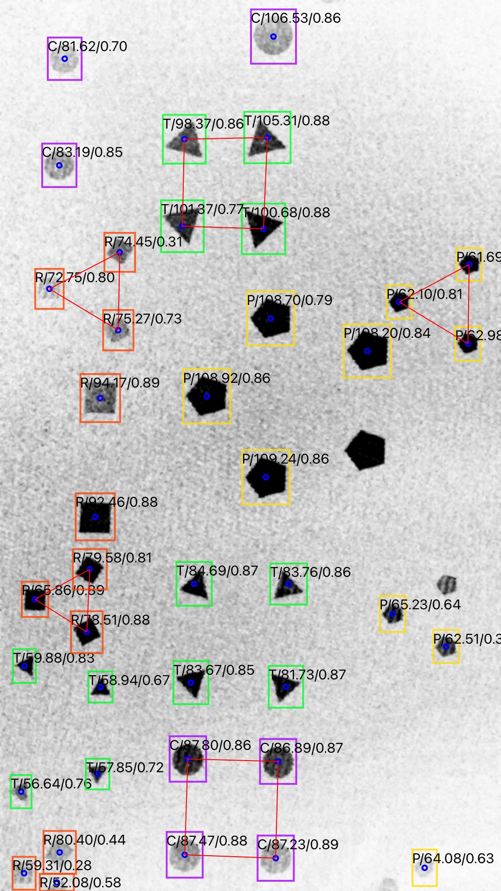
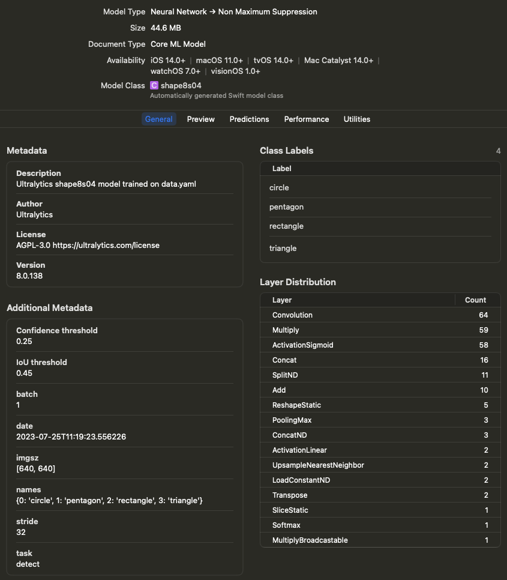
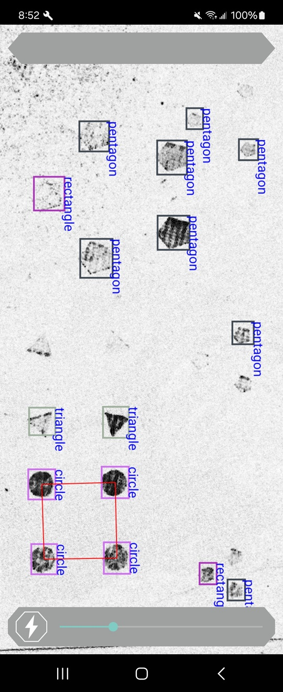

## iOS App - Swift / Storyboard / CoreML

* The iOS app was developed using the Swift language, and UI design was implemented using Storyboard. GPUImage/OpenCV were utilized to reveal hidden shapes, while CoreML/Vision Framework were used for shape recognition.

### Image Processing / GPUImage2 

* The original image contains hidden shapes that are imperceptible to the human eye, and the GPUImage filter reveals these hidden shapes. 

* Original Image 

 

* Processed by GPUImage/OpenCV



* CoreML Detection Result

Labels on each Shape

|Type|Size|Score|
|----|----|-----|
|T: Triangle<br/>R: Rectangle<br>P: Pentagon<br/>C: Circle<br/>|Number of Pixels Occupied|Confidence Score: 0.0 ~ 1.0|



### CoreML / Vision Framework

* Add CoreML model file to project



* Setup CoreML 

```swift
    func setUpModel() {
        guard let objectDectectionModel = objectDectectionModel else { fatalError("fail to load the model") }
        if let visionModel = try? VNCoreMLModel(for: objectDectectionModel.model) {
            self.visionModel = visionModel
            request = VNCoreMLRequest(model: visionModel, completionHandler: visionRequestDidComplete)
            request?.imageCropAndScaleOption = .scaleFill
        } else {
            fatalError("fail to create vision model")
        }
    }

```

* Post-Processing

```swift

    func visionRequestDidComplete(request: VNRequest, error: Error?) {
        if let predictions = request.results as? [VNRecognizedObjectObservation] {
            
            self.predictions = predictions
            DispatchQueue.main.async {

                if let imageSrc = self.imageAfterOpenCV {
                    
                    let processor = ShapeProcessor(predictions: self.predictions, imageSrc: imageSrc)
                    self.openCVIV.image = processor.imageOut
                    var detectedCode = processor.resultCode
                    
                    if detectedCode != "NONE" {
                        if detectedCode == "S3_M4" || detectedCode == "S4_MC" || detectedCode == "S4_M5" || detectedCode == "S4_M3" || detectedCode == "S3_MC" || detectedCode == "S3_M5" || detectedCode == "S3_M3" || detectedCode == "S4_M4" { // 8
                            self.workDispatch?.cancel()
                            let resultVC =  self.storyboard?.instantiateViewController(withIdentifier: "ResultVC") as! ResultVC
                            resultVC.resultCode = detectedCode
                            resultVC.modalPresentationStyle = .fullScreen
                            self.present(resultVC, animated: false, completion: nil)
                            self.initTimeout()
                            
                        }
                    }
                    //
                    if (self.saveImageFlag) {
                        if let imgOut = processor.imageOut {
                            UIImageWriteToSavedPhotosAlbum(imgOut, nil, nil, nil)

                            let saveOkayVC : SaveConfirmVC = self.storyboard?.instantiateViewController(withIdentifier: "saveComplete") as! SaveConfirmVC
                            self.navigationController?.modalPresentationStyle = UIModalPresentationStyle.currentContext
                            self.present(saveOkayVC, animated: false, completion: nil)
                        }
                    }
                    self.saveImageFlag = false;

                }

                self.isInferencing = false
            }
        } else {
            
            self.isInferencing = false
        }
        self.semaphore.signal()
    }

```


## GPUImage / OpenCV Image Operation

Hidden shapes are invisible with human eyes, and those will be converted with the filters below to be visible.

### Filters Applied

```swift

if (configType == 7) {
    camera = try Camera(sessionPreset: .hd1920x1080)
    prewittEdge[0].edgeStrength = 0.7
    closing[0].radius = 1
    gaussianBlur[0].blurRadiusInPixels = 1
    erosion[0].radius = 1
    
    camera --> prewittEdge[0] --> closing[0] --> colorInversion[0] --> gaussianBlur[0] --> erosion[0] --> openCVBuf
    camera --> renderView
    desiredZoomFactor = 1.6
}

```

### GPUImage Custom Filter for interoperability with CoreML/OpenCV

```swift

import CoreGraphics

#if canImport(UIKit)
import UIKit
#else
import Cocoa
#endif

import AVFoundation
import Vision

public class OpenCVBuffer: ImageProcessingOperation {
    public var bufferSize:UInt = 1
    public var activatePassthroughOnNextFrame = true
    
    public let maximumInputs:UInt = 1
    public let targets = TargetContainer()
    public let sources = SourceContainer()
    var bufferedFramebuffers = [Framebuffer]()
    var imageFramebuffer:Framebuffer!
    var hasProcessedImage:Bool = false
    public var imageAvailableCallback:((UIImage) -> UIImage)?


    public init() {
    }
    
    
    public func newFramebufferAvailable(_ framebuffer:Framebuffer, fromSourceIndex:UInt) {
        
        if let imageCallback = imageAvailableCallback {
            let cgImageFromBytes = cgImageFromFramebuffer(framebuffer)
            let image = UIImage(cgImage:cgImageFromBytes, scale:1.0, orientation:.up)

            let transmitImage = imageCallback(image)
            let ciImage = CIImage(image: transmitImage)
            if let ciImageSafe = ciImage {
                let ciContext = CIContext(options: nil)
                let cgImage = ciContext.createCGImage(ciImageSafe, from: ciImageSafe.extent)
                if let cgImageSafe = cgImage {
                    //prepareTransmitFrame(image: cgImageSafe)
                }
            }
        }
        
    }
    
    public func prepareTransmitFrame(image:CGImage, smoothlyScaleOutput:Bool = false, orientation:ImageOrientation = .portrait) {
        let widthOfImage = GLint(image.width)
        let heightOfImage = GLint(image.height)
        
        guard((widthOfImage > 0) && (heightOfImage > 0)) else { fatalError("Tried to pass in a zero-sized image") }

        var widthToUseForTexture = widthOfImage
        var heightToUseForTexture = heightOfImage
        var shouldRedrawUsingCoreGraphics = false
        
        let scaledImageSizeToFitOnGPU = GLSize(sharedImageProcessingContext.sizeThatFitsWithinATextureForSize(Size(width:Float(widthOfImage), height:Float(heightOfImage))))
        if ((scaledImageSizeToFitOnGPU.width != widthOfImage) && (scaledImageSizeToFitOnGPU.height != heightOfImage)) {
            widthToUseForTexture = scaledImageSizeToFitOnGPU.width
            heightToUseForTexture = scaledImageSizeToFitOnGPU.height
            shouldRedrawUsingCoreGraphics = true
        }
        
        if (smoothlyScaleOutput) {
            let powerClosestToWidth = ceil(log2(Float(widthToUseForTexture)))
            let powerClosestToHeight = ceil(log2(Float(heightToUseForTexture)))
            
            widthToUseForTexture = GLint(round(pow(2.0, powerClosestToWidth)))
            heightToUseForTexture = GLint(round(pow(2.0, powerClosestToHeight)))
            shouldRedrawUsingCoreGraphics = true
        }
        
        var imageData:UnsafeMutablePointer<GLubyte>!
        var dataFromImageDataProvider:CFData!
        var format = GL_BGRA
        
        if (!shouldRedrawUsingCoreGraphics) {
            if ((image.bytesPerRow != image.width * 4) || (image.bitsPerPixel != 32) || (image.bitsPerComponent != 8))
            {
                shouldRedrawUsingCoreGraphics = true
            } else {
                let bitmapInfo = image.bitmapInfo
                if (bitmapInfo.contains(.floatComponents)) {
                    shouldRedrawUsingCoreGraphics = true
                } else {
                    let alphaInfo = CGImageAlphaInfo(rawValue:bitmapInfo.rawValue & CGBitmapInfo.alphaInfoMask.rawValue)
                    if (bitmapInfo.contains(.byteOrder32Little)) {
                        if ((alphaInfo != CGImageAlphaInfo.premultipliedFirst) && (alphaInfo != CGImageAlphaInfo.first) && (alphaInfo != CGImageAlphaInfo.noneSkipFirst)) {
                                shouldRedrawUsingCoreGraphics = true
                        }
                    } else if ((bitmapInfo.contains(CGBitmapInfo())) || (bitmapInfo.contains(.byteOrder32Big))) {
                        if ((alphaInfo != CGImageAlphaInfo.premultipliedLast) && (alphaInfo != CGImageAlphaInfo.last) && (alphaInfo != CGImageAlphaInfo.noneSkipLast)) {
                                shouldRedrawUsingCoreGraphics = true
                        } else {
                            format = GL_RGBA
                        }
                    }
                }
            }
        }
        
        if (shouldRedrawUsingCoreGraphics) {
            imageData = UnsafeMutablePointer<GLubyte>.allocate(capacity:Int(widthToUseForTexture * heightToUseForTexture) * 4)

            let genericRGBColorspace = CGColorSpaceCreateDeviceRGB()
            
            let imageContext = CGContext(data:imageData, width:Int(widthToUseForTexture), height:Int(heightToUseForTexture), bitsPerComponent:8, bytesPerRow:Int(widthToUseForTexture) * 4, space:genericRGBColorspace,  bitmapInfo:CGImageAlphaInfo.premultipliedFirst.rawValue | CGBitmapInfo.byteOrder32Little.rawValue)
            imageContext?.draw(image, in:CGRect(x:0.0, y:0.0, width:CGFloat(widthToUseForTexture), height:CGFloat(heightToUseForTexture)))
        } else {
            dataFromImageDataProvider = image.dataProvider?.data
#if os(iOS)
            imageData = UnsafeMutablePointer<GLubyte>(mutating:CFDataGetBytePtr(dataFromImageDataProvider))
#else
            imageData = UnsafeMutablePointer<GLubyte>(mutating:CFDataGetBytePtr(dataFromImageDataProvider)!)
#endif
        }
        
        sharedImageProcessingContext.runOperationSynchronously{
            do {
                self.imageFramebuffer = try Framebuffer(context:sharedImageProcessingContext, orientation:orientation, size:GLSize(width:widthToUseForTexture, height:heightToUseForTexture), textureOnly:true)
            } catch {
                fatalError("ERROR: Unable to initialize framebuffer of size (\(widthToUseForTexture), \(heightToUseForTexture)) with error: \(error)")
            }
            
            glBindTexture(GLenum(GL_TEXTURE_2D), self.imageFramebuffer.texture)
            if (smoothlyScaleOutput) {
                glTexParameteri(GLenum(GL_TEXTURE_2D), GLenum(GL_TEXTURE_MIN_FILTER), GL_LINEAR_MIPMAP_LINEAR)
            }
            
            glTexImage2D(GLenum(GL_TEXTURE_2D), 0, GL_RGBA, widthToUseForTexture, heightToUseForTexture, 0, GLenum(format), GLenum(GL_UNSIGNED_BYTE), imageData)
            
            if (smoothlyScaleOutput) {
                glGenerateMipmap(GLenum(GL_TEXTURE_2D))
            }
            glBindTexture(GLenum(GL_TEXTURE_2D), 0)
        }

        if (shouldRedrawUsingCoreGraphics) {
            imageData.deallocate()
        }
    }

    
    
    public func transmitPreviousImage(to target:ImageConsumer, atIndex:UInt) {

    }
    
    func cgImageFromFramebuffer(_ framebuffer:Framebuffer) -> CGImage {
        let renderFramebuffer = sharedImageProcessingContext.framebufferCache.requestFramebufferWithProperties(orientation:framebuffer.orientation, size:framebuffer.size)
        renderFramebuffer.lock()
        renderFramebuffer.activateFramebufferForRendering()
        clearFramebufferWithColor(Color.red)
        renderQuadWithShader(sharedImageProcessingContext.passthroughShader, uniformSettings:ShaderUniformSettings(), vertexBufferObject:sharedImageProcessingContext.standardImageVBO, inputTextures:[framebuffer.texturePropertiesForOutputRotation(.noRotation)])
        framebuffer.unlock()
        
        let imageByteSize = Int(framebuffer.size.width * framebuffer.size.height * 4)
        let data = UnsafeMutablePointer<UInt8>.allocate(capacity: imageByteSize)
        glReadPixels(0, 0, framebuffer.size.width, framebuffer.size.height, GLenum(GL_RGBA), GLenum(GL_UNSIGNED_BYTE), data)
        renderFramebuffer.unlock()
        guard let dataProvider = CGDataProvider(dataInfo:nil, data:data, size:imageByteSize, releaseData: dataProviderReleaseCallback) else {fatalError("Could not allocate a CGDataProvider")}
        let defaultRGBColorSpace = CGColorSpaceCreateDeviceRGB()
        return CGImage(
            width: Int(framebuffer.size.width),
            height: Int(framebuffer.size.height),
            bitsPerComponent: 8,
            bitsPerPixel: 32,
            bytesPerRow: 4 * Int(framebuffer.size.width),
            space: defaultRGBColorSpace,
            bitmapInfo: CGBitmapInfo(rawValue: CGImageAlphaInfo.noneSkipLast.rawValue),
            provider: dataProvider,
            decode:nil, shouldInterpolate:false, intent:.defaultIntent)!
    }

}


```

### GPUImage Custom Filter Callback Method

```swift

openCVBuf.imageAvailableCallback = {image in
    self.imageAfterOpenCV = image

    DispatchQueue.main.async{
        guard let request = self.request else { fatalError() }
        self.semaphore.wait()
        let handler = VNImageRequestHandler(cvPixelBuffer: image.pixelBufferFromImage())
        try? handler.perform([request])

    }
    return self.imageAfterOpenCV!
}

```


## Android App - Kotlin / Tensroflow Lite / GPUImage

The Android App is developed using the Kotlin language. The GPUImage available on Android is implemented based on OpenGL ES 2.0, which differs in implementation from iOS's GPUImage. Consequently, custom filters cannot be used. Instead, the Camera Source was modified to invoke GPUImage Filters upon frame creation, and the resulting output is passed to the ObjectorDetector to perform Shape Detection.

### ObjectorDetector Initialization

Initialize the ObjectorDetector to use the Float16-Quantized TFLite file.

```Java

    if (mlCodeDetector == null) {
        // Step 2: Initialize the detector object
        val options = ObjectDetector.ObjectDetectorOptions.builder()
            .setMaxResults(-1)
            .setScoreThreshold(MLDetectActivity.detectThreshold)
            .build()
        mlCodeDetector = ObjectDetector.createFromFileAndOptions(
            mContext,
            "float16_metadata_maxout_100.tflite",
            options
        )
    }

```

Initialize the GPUImage filter settings, apply the filter to the image, and return the result.

```Java

    private fun GetDCOPBitmap_GPUImg(
        lfrmCamPreview: Frame,
        lbcdCallback: MLDetectTrackerCallback?
    ): Bitmap?  {
        val bmpImageOrg = getBitmapFromRGBFrame(lfrmCamPreview)

        if (_GPUIMG == null) {
            _GPUIMG = GPUImage(mContext)
            var filterGroup = GPUImageFilterGroup()

            var grayscaleFilter = GPUImageGrayscaleFilter()
            filterGroup.addFilter(grayscaleFilter)

            val sharpen = GPUImageSharpenFilter()
            sharpen.setSharpness(1.0f)
            filterGroup.addFilter(sharpen)

            val sobelEdge = GPUImageSobelEdgeDetectionFilter()
            //sobelEdge.setLineSize(1.0f)
            filterGroup.addFilter(sobelEdge)

            var colorInv = GPUImageColorInvertFilter()
            filterGroup.addFilter(colorInv)

            var boxBlur = GPUImageBoxBlurFilter()
            boxBlur.setBlurSize(1.0f)
            //filterGroup.addFilter(boxBlur)

            val gamma = GPUImageGammaFilter()
            gamma.setGamma(0.4f)
            //filterGroup.addFilter(gamma)

            _GPUIMG!!.setFilter(filterGroup)
        }
        _GPUIMG!!.setImage(bmpImageOrg)
        val filteredBitmap = _GPUIMG!!.bitmapWithFilterApplied

        return filteredBitmap
    }


```

Receive the image processed by the GPUImage filter, convert it to a TensorImage, and perform Object Detection.

```Java

    fun DetectCodes(bmpImage: Bitmap, bcdCallback: MLDetectTrackerCallback?): Bitmap? {
        // Step 1: Create TFLite's TensorImage object
        val image = TensorImage.fromBitmap(bmpImage)

        if (mlCodeDetector == null) {
            // Step 2: Initialize the detector object
            val options = ObjectDetector.ObjectDetectorOptions.builder()
                .setMaxResults(-1)
                .setScoreThreshold(MLDetectActivity.detectThreshold)
                .build()
            mlCodeDetector = ObjectDetector.createFromFileAndOptions(
                mContext,
                "float16_metadata_maxout_100.tflite",
                options
            )
        }

        // Step 3: Feed given image to the detector
        val results = mlCodeDetector?.detect(image)

        val shapeProc = ShapeProcessor(results, bmpImage)

        val imgWithResult = shapeProc.imageOut
        if (!shapeProc.resultCode.equals("none", true)) {
            val bcdData = Barcode()
            bcdData.displayValue = shapeProc.resultCode
            bcdCallback?.onDetectedQrCode(bcdData)
        }

        return imgWithResult
    }


```


### Shape Detection Result





