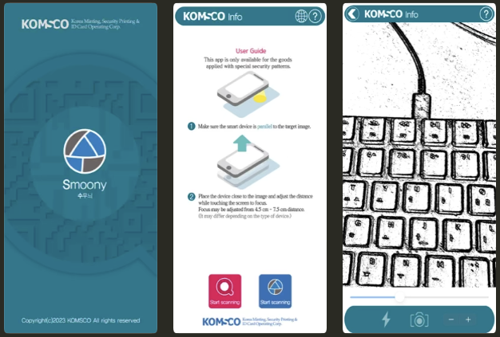

## Overview

This software development project was carried out from August to November 2023 and includes functionalities such as 

- displaying hidden images through image processing
- detecting hidden QR/DataMatrix barcodes
- supporting three languages: Korean, English, and Chinese.

## Languages and Libraries

- iOS: Swift + Storyboard
- Android: Kotlin
- [GPUImage2](https://github.com/BradLarson/GPUImage2) - iOS
    - I tried GPUImage3(the latest version), but the library has changed its structure and some filters are not implemented(yet?). So, I had to GPUImage2 and added custom filter for barcode detector.
- [Android-GPUImage](https://github.com/cats-oss/android-gpuimage) - Android
    - OpenGL ES 2.0 Based Filters
- [OpenCV 3.4.x](https://github.com/opencv/opencv/tree/3.4.16) - iOS/Android
    - I also tried OpenCV 4.x, but I couldn't get OpenCV 4.x Camera input on Android Devices correctly(not sure what caused it), so I tested V3.4.16 and chose it. 

## App Download

- iOS App: Swift - [App Store](https://apps.apple.com/us/app/smoony/id938560544)
- Android App: Kotlin - [Google Play](https://play.google.com/store/apps/details?id=com.komsco.android.smoony&pcampaignid=web_share)

## Features

- Hidden images are printed with special patterns that make unvisible with human eyes.
- Combination of filters will process the image and the hidden image can be seen.
- QR Code and DataMatrix barcodes also can be hidden and detected using similar filters.


