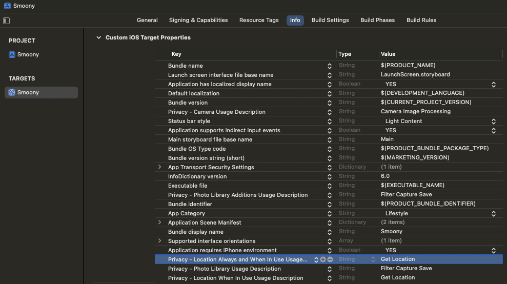

## Get the location on iOS

### Add keys on Custom iOS Target Properties
> TARGET -> Info -> Custom iOS Target Properties

> Privacy - Location Always and When In Use Usage Description

> Privacy - Location When In Use Usage Description


