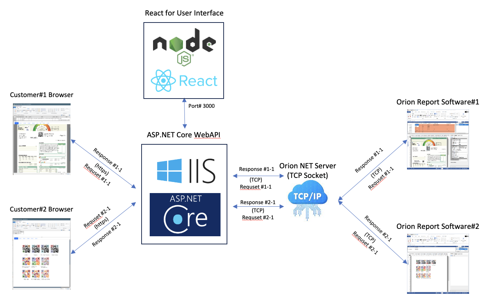
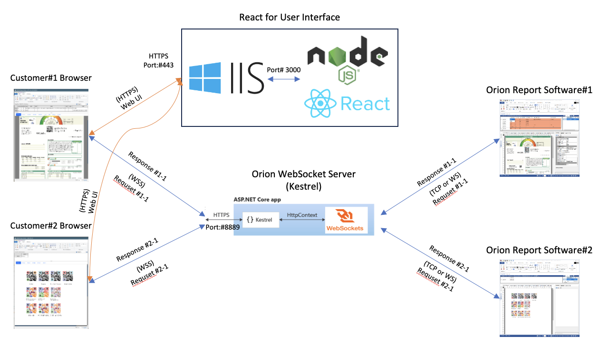

## Overview

For years, the development of a new web-based user interface for the Orion Report Editor has been in progress. Orion itself features the ability to create HTML5-Canvas (JavaScript) outputs, but these outputs are static HTML pages. The Web Editor module enables Orion to design forms and create outputs via the Web without the need to install the Orion Report Designer application to the customer's local PC. Moreover, Mac and Linux users can also use Orion Report Designer through the Web. It was originally developed in 2017 using ASP.NET WebAPI (.NET Framework) and JavaScript. In late 2023, it was redesigned with ASP.NET Core WebAPI (.NET 8) and React/TypeScript.

In March 2024, I am integrating Orion's Web Editor module into a customer's environment, and the WebAPI has been replaced with WebSocket.

- The Web Editor needs to be embedded into the customer's shopping mall site, which is hosted on the Cafe24 shopping mall services.
- The Web Editor will be a part (Modal or Frame) of Cafe24's product page, using IFRAME or EMBED tags.
- SSL (HTTPS, WSS) is required.

****

- Orion Web Editor with WebAPI 
    

*****

- Orion Web Editor with Kestrel and WebSocket 
    

****
