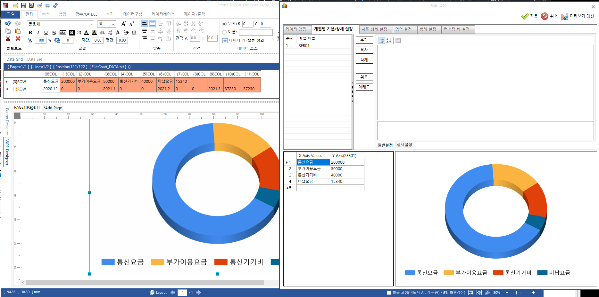
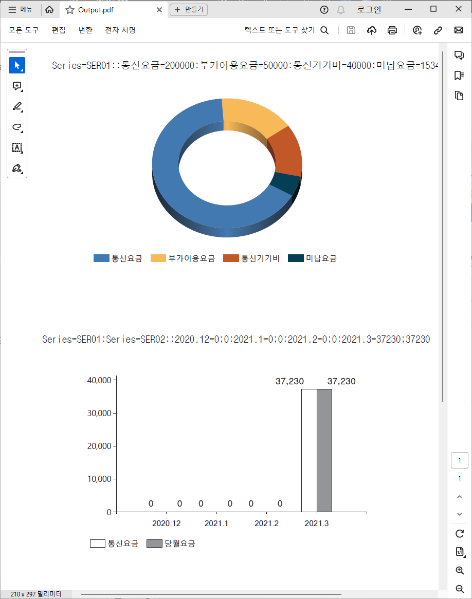
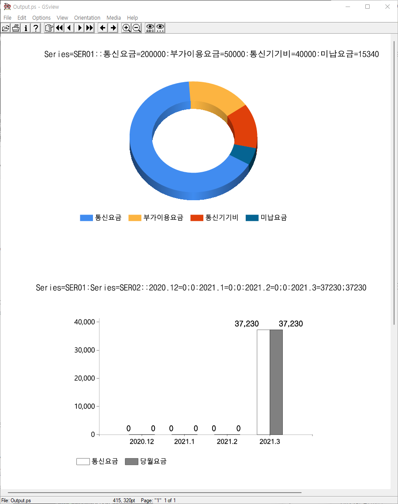
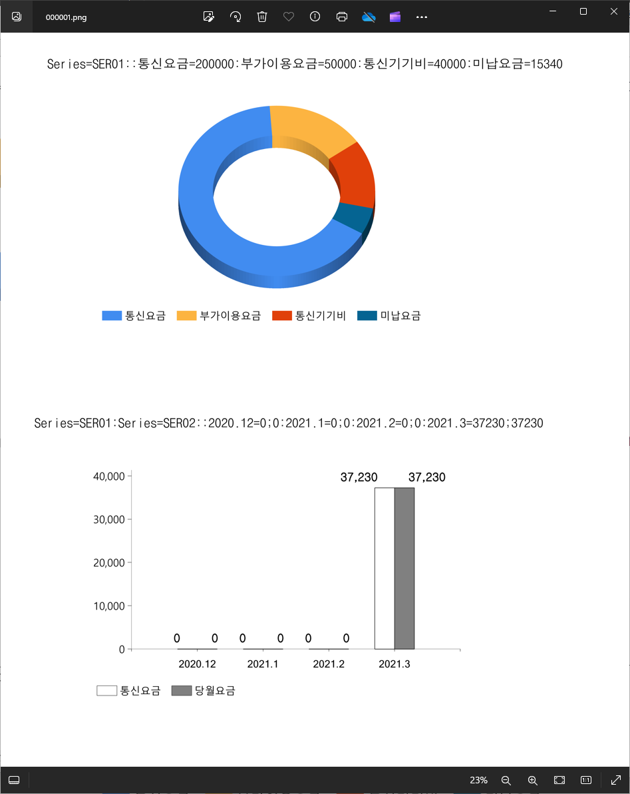

## Overview

As you may know, .NET provides nice [Data Visualization features](https://github.com/dotnet/winforms-datavisualization/tree/main).


But, .NET Data Visualization only supports RGB raster image charts(.png, .jpg, etc) and creating high-resolution images takes much time. Also, does not supoort PDF and PostScript outputs for volume printing.

- Why PDF and PostScript outputs
    - The size of PDF/PostScript charts in high-resolution output is normally 10kb ~ 50kb per chart, but the size of raster image charts(.png, .jpg, .tif formats) may have 1mb ~ 5mb size.
    - Much faster creation, comparing to bitmap charts.
    - Let's assume we create a chart with 2x2-inch (600 dpi resultion). While drawing raster chart image needs to handle 3 or 4 bytes for 1,200x1,200=1,440,000 pixels, this will cause slow and huge outputs. But, for vector outputs like PDF/PostScript, drawing lines/circles/stroke/fill commands just need few bytes and all these commands will be executed to create rasterization images by Adobe Acrobat PDF Readers or Printers.
    - PostScript and PDF support CMYK, printing color images requires CMYK color-space for precise colors.

- PDF, PostScript Chart Features
    - Support CMYK color-space
    - 100% vector graphics
    - Fonts and reusable objects(images) are not duplicated in PDF and PostScript output
    - iTextSharp(PDF) and custom PostScript libraries are used
    - Features above result faster speed and smaller outputs

- Source code for [.NET 8 Data Visualization with PDF and PostScript](https://github.com/heungwook/NET8_DataVisualization)

- Chart Designer

    


## Implementation of PDF & PostScript Charts

.NET Data Visualization library uses GDI+ for drawing chart's components like X-Y axis lines, ellipses and label texts. So, I've implemented PDF and PostScript warappers to replace all GDI+ drawing methods that are used in chart drawing.

### Performance Comparisons: PDF vs PostScript vs Image Charts

- 1,000 pages (A4), 2 charts/page

    |    | PDF Chart (CMYK Color-Space) | PostScript Chart | Image Chart |
    |----|-----------|------------------|-------------|
    | Creation Time | 14 seconds | 10 seconds | 35 minutes |
    | File Size | 7,362 kb | 2,641 kb | 430 mb | 

- [PDF Chart Sample - CMYK Color-Space](Charts_2000Charts_1000Pages_14sec.pdf)

    


- [PostScript Chart Sample](Charts_2000Charts_1000Pages_10sec.ps)

    


- Image Chart Sample - 600x600 dpi in PNG format

    


### Entry Points to Create PDF, PostScript Charts

- SavePDF(), SavePS() methods in ChartWinControls.cs are the entry points for PDF, PostScript charts creation. And, these methods initialize the rendering information of PDF and PostScript.

- SavePDF() Method

    ```C#
    // -ChartPDF

    public void SavePDF(string lsPdfFile, System.Windows.Point chartLocation, PdfGraphicsInfo.EnumColorSpace lColorSpace, OrionX2.OrionFont.FontManagerConfig fontMgr, bool lbUseKValueCMYKEqual)
    {
        using (FileStream lfsPdf = new FileStream(lsPdfFile, FileMode.Create, FileAccess.ReadWrite, FileShare.ReadWrite))
        {
            SavePDF(lfsPdf, chartLocation, lColorSpace, fontMgr, lbUseKValueCMYKEqual);
            lfsPdf.Close();
        }
        
    }

    public void SavePDF(Stream lStrm, System.Windows.Point chartLocation, PdfGraphicsInfo.EnumColorSpace colorSpace, OrionX2.OrionFont.FontManagerConfig fontMgr, bool lbUseKValueCMYKEqual)
    {
        try
        {
            iTextSharp.text.FontFactory.RegisterDirectory(@"C:\Windows\Fonts");
            iTextSharp.text.Rectangle pdfPageSize = new iTextSharp.text.Rectangle(0, 0, 
                (float)OrionX2.ConfigInfo.UCNV.GetPointFromPixel(this.Width, renderingDpiX),
                (float)OrionX2.ConfigInfo.UCNV.GetPointFromPixel(this.Height, renderingDpiY), 0);
            using (iTextSharp.text.Document pdfDoc = new iTextSharp.text.Document(pdfPageSize))
            {

                iTextSharp.text.pdf.PdfWriter pdfWrt = iTextSharp.text.pdf.PdfWriter.GetInstance(pdfDoc, lStrm);
                pdfDoc.Open();
                pdfDoc.NewPage();

                SavePDF(chartLocation, pdfDoc, pdfWrt, colorSpace, fontMgr, lbUseKValueCMYKEqual);
                pdfDoc.Close();
            }
        }
        finally
        {

        }
    }

    public void SavePDF(System.Windows.Point chartLocation, iTextSharp.text.Document pdfDoc, iTextSharp.text.pdf.PdfWriter pdfWrt, PdfGraphicsInfo.EnumColorSpace colorSpace, OrionX2.OrionFont.FontManagerConfig fontMgr, bool lbUseKValueCMYKEqual)
    {
        PdfGraphicsInfo lPdfInfo = new PdfGraphicsInfo(fontMgr,  new System.Windows.Rect(chartLocation.X, chartLocation.Y, this.Width, this.Height), 
            RenderingDpiX, RenderingDpiY, lbUseKValueCMYKEqual);
        PSGraphicsInfo lPSInfo = new PSGraphicsInfo(null, null, fontMgr,
            new System.Windows.Rect(chartLocation.X, chartLocation.Y, this.Width, this.Height), RenderingDpiX, RenderingDpiY);
        try
        {
            lPdfInfo.cPdfDoc = pdfDoc;
            lPdfInfo.cPdfWrt = pdfWrt;
            lPdfInfo.ceColorSpace = colorSpace;
            lPdfInfo.DpiX = RenderingDpiX;
            lPdfInfo.DpiY = RenderingDpiY;

            SavePDF(lPdfInfo);

        }
        finally
        {

        }
    }

    public void SavePDF(PdfGraphicsInfo lPdfInfo)
    {
        this.chartPicture.isSavingAsImage = true;
        this.chartPicture.GetPDF(lPdfInfo);
        this.chartPicture.isSavingAsImage = false;
    }
    // ChartPDF-
    ```


- SavePS() Method

    ```C#
    // -ChartPS

    public void SavePS(System.Windows.Point chartLocation, PdfGraphicsInfo.EnumColorSpace colorSpace, OrionX2.OrionFont.FontManagerConfig fontMgr, Dictionary<string, PSFontData> ldctPSFonts, Stream lStrmHeader, Stream lStrmBody)
    {
        PSGraphicsInfo lPSInfo = new PSGraphicsInfo(lStrmHeader, lStrmBody, fontMgr,
            new System.Windows.Rect(chartLocation.X, chartLocation.Y, this.Width, this.Height), RenderingDpiX, RenderingDpiY);
        PdfGraphicsInfo lPdfInfo = new PdfGraphicsInfo(fontMgr, new System.Windows.Rect(chartLocation.X, chartLocation.Y, this.Width, this.Height),
            RenderingDpiX, RenderingDpiY, true);//lbUseKValueCMYKEqual);
        lPSInfo.cdctFontData = ldctPSFonts;
        try
        {
            lPSInfo.ceColorSpace = colorSpace;
            lPSInfo.DpiX = RenderingDpiX;
            lPSInfo.DpiY = RenderingDpiY;

            SavePS(lPSInfo);
        }
        finally
        {

        }
    }

    public void SavePS(PSGraphicsInfo lPSInfo)
    {
        this.chartPicture.isSavingAsImage = true;
        this.chartPicture.GetPS(lPSInfo);
        this.chartPicture.isSavingAsImage = false;
    }
    // ChartPS-
    ```


### GDI+, PDF, PostScript Rendering Code


- RenderGDI Code

    - _graphics is GDI+ System.Drawing.Graphics object and it calls GDI+ DrawLine() methods.

    ```C#
    ...
    public void DrawLine(
                Pen pen,
                PointF pt1,
                PointF pt2
                )
    {
        _graphics.DrawLine(pen.ToGdiPen(), pt1, pt2);
    }
    ...
    ```

- RenderingGraphicsPDF Code

    - this.cPdfCnts is iTextSharp's PdfContentsBytes object and it draws a line on PDF page. 

    ```C#
    ...
    public void DrawLine(
        Pen pen,
        PointF pt1px,
        PointF pt2px
        )
    {
        if (pen.Color.IsEmpty || pen.Color.A == 0)
            return;
        float x1Pt = (float)UCNV.GetPointFromPixel(pt1px.X, this.DpiX);
        float y1Pt = (float)(this.ChartHeightPt - UCNV.GetPointFromPixel(pt1px.Y, this.DpiY));
        float x2Pt = (float)UCNV.GetPointFromPixel(pt2px.X, this.DpiX);
        float y2Pt = (float)(this.ChartHeightPt - UCNV.GetPointFromPixel(pt2px.Y, this.DpiY));
        this.cPdfCnts.MoveTo(x1Pt, y1Pt);
        this.cPdfCnts.LineTo(x2Pt, y2Pt);
        pen.ToPdfPen(this);
        this.cPdfCnts.Stroke();
    }
    ...
    ```

- PSGraphicsInfo Code

    - PS_moveto()/PS_lineto() methods create PostScript commands to draw a line. 

    ```C#
    ...
    internal static string csPSmoveto = "m";
    internal static string csPSlineto = "l";
    ...
    public void DrawLine(
        Pen pen,
        PointF pt1px,
        PointF pt2px
        )
    {
        if (pen.Color.IsEmpty || pen.Color.A == 0)
            return;
        float x1Pt = (float)UCNV.GetPointFromPixel(pt1px.X, this.DpiX);
        float y1Pt = (float)(this.ChartHeightPt - UCNV.GetPointFromPixel(pt1px.Y, this.DpiY));
        float x2Pt = (float)UCNV.GetPointFromPixel(pt2px.X, this.DpiX);
        float y2Pt = (float)(this.ChartHeightPt - UCNV.GetPointFromPixel(pt2px.Y, this.DpiY));
        this.PS_moveto(x1Pt, y1Pt);
        this.PS_lineto(x2Pt, y2Pt);
        pen.ToPSPen(this);
        this.PS_stroke();
    }
    ...
    internal void PS_moveto(float lfX, float lfY)
    {
        WriteTo_LF(String.Format("{0:0.###} {1:0.###} {2}", lfX, lfY, csPSmoveto));
    }
    internal void PS_lineto(float lfX, float lfY)
    {
        WriteTo_LF(String.Format("{0:0.###} {1:0.###} {2}", lfX, lfY, csPSlineto));
    }
    ```

