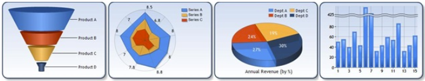

## Overview

As you may know, .NET provides nice [Data Visualization features](https://github.com/dotnet/winforms-datavisualization/tree/main).

But, .NET Data Visualization only supports RGB raster image charts(.png, .jpg, etc) and creating high-resolution images takes much time. Also, does not supoort PDF and PostScript outputs for volume printing.

- PDF and PostScript outputs
    - The size of PDF/PostScript charts in high-resolution output is normally 10kb ~ 50kb per chart, but the size of raster image charts(.png, .jpg, .tif formats) may have 1mb ~ 5mb size.
    - Much faster creation, comparing to bitmap charts.
    - Let's assume we create a chart with 2x2-inch (600 dpi resultion). While drawing raster chart image needs to handle 3 or 4 bytes for 1,200x1,200=1,440,000 pixels, this will cause slow and huge outputs. But, for vector outputs like PDF/PostScript, drawing lines/circles/stroke/fill commands just need few bytes and all these commands will be executed to create rasterization images by Adobe Acrobat PDF Readers or Printers.
    - PostScript and PDF support CMYK, printing color images requires CMYK color-space for precise colors.

