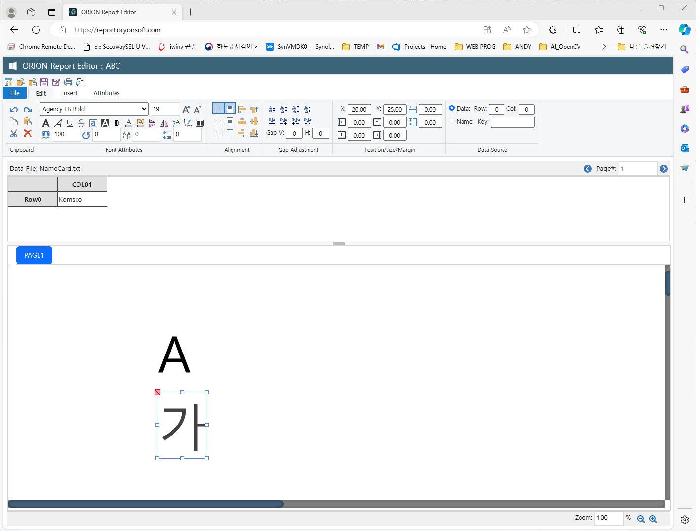
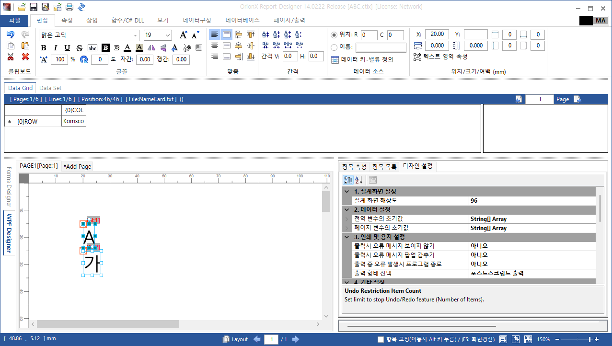
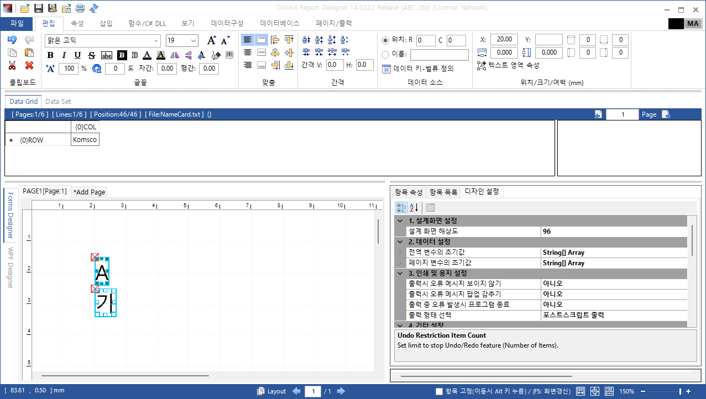
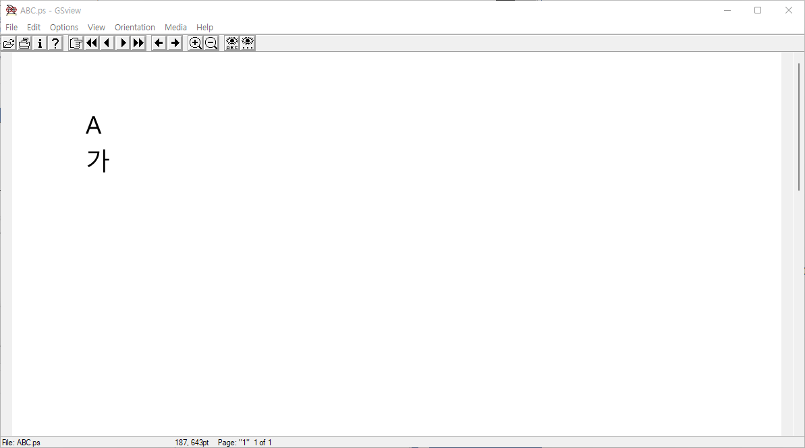
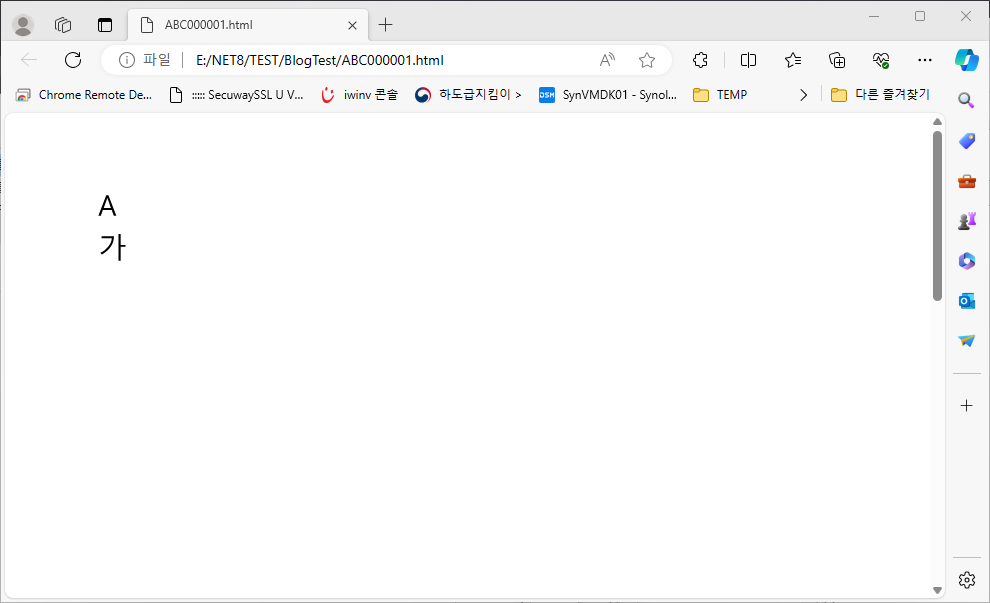

## Overview

Orion Rport Designer supports various output formats including PDF, PostScript, HTML-5, Images(png, jpg, tiff, bmp) and also supports WPF, WinForms, Web design user interfaces.
Each output handles text fonts in different ways, 

- WPF supports TTF(TreuType Font) and OTF(OpenType Font)
- WinForms only supports TTF
- PostScript supports PS specific fonts which are not compatible with other output formats
- HTML supports TTF/OTF, WOFF, WOFF2

Drawing the exactly same text in different output formats is a key issue. 

So, for the unified way of drawing texts in PDF, PostScript, HTML-5 Canvas, WPF and WinForms, WPF font geometry would be a good choice. WPF can extract font geometry from TTF/OTF font files and WPF geometry can be converted to GDI+ Graphics Path. GDI+ Graphics Path also converted to PostScript path and HTML-5 Canvas Path. 

Using path based text presentation requires some tricks for better speed and smaller outputs.

- WPF Geometries/GDI+ graphics pathes should be cached
    - Extracting geometry from font file and converion takes time
- PostScript and HTML-5 Canvas font pathes should be reused
    - In PostScript, once a character is used, put its path into the header of PS file then call the definition when reuse the character
    - In HTML, the path of a character is defined as a function at the top of JavaScript, then the function is called where the character appears
- PostScript header and body should be compressed
- To support extended font styles like reverse-order, flips(horizontally, vertically), width-height ratio, outlined, character gap, line gap all output formats should have commands for transforming the pathes 

- Web Version of Designer UI

    

- WPF Version of Designer UI

    

- WinForms Version of Designer UI

    


## Using WPF Font Geometry

### Getting WPF Font Geometry

```C#
public static Geometry BuildGeometry(string lsFntFamily, string lsCH, double positionXDiu, double positionYDiu)
{
    System.Windows.Media.Geometry lGeom = null;

    try
    {
        System.Windows.Media.FormattedText lFTXT = new System.Windows.Media.FormattedText(lsCH,
                                                            System.Threading.Thread.CurrentThread.CurrentUICulture,
                                                            FlowDirection.LeftToRight,
                                                            new Typeface(lsFntFamily),
                                                            UCNV.GetDIUFromPoint(_DEFFONTSIZE),
                                                            System.Windows.Media.Brushes.Black);

        lGeom = lFTXT.BuildGeometry(new Point(positionXDiu, positionYDiu));
    }
    catch (Exception lExe)
    {
        lGeom = null;
        ORIONDEBUG.LOG(LogInfo.EnumLogLevel.ERROR, "WpfFontCache::BuildGeometry()", lExe);
    }

    return lGeom;
}
```

### Drawing WPF Font Geometry

- Set rotation
    >Matrix lMtrx = new Matrix();<br/>
    if (lCD.fRotation != 0F)<br/>
    {<br/>
        Point lptRotateCenterPercent = WPF.UC_Item.GetRotateCenterPercent(lCD);<br/>
        lMtrx.RotateAt(lCD.fRotation, lSzTBoxDIU.Width * lptRotateCenterPercent.X, lSzTBoxDIU.Height * lptRotateCenterPercent.Y);<br/>
    }<br/>
    lCD.cItemCanvas.RenderTransform = new MatrixTransform(lMtrx);<br>

- Get geometry from cache
    >System.Windows.Media.Geometry lGeom = GlyphInfoCache.GetWpfGeomCache(lGlyph, lPD.fWidthDPI, lPD.fHeightDPI, ldFontSize, ldFontScaleW, 1F);

- Set Italic, Horizontal/Vertical Flips
    >lMtrx = ((MatrixTransform)lGeom.Transform).Matrix;<br/>
    if (lCD.cbFontFlipVert)<br/>
        lMtrx.Append(new Matrix(1, 0, 0, -1, 0, UCNV.GetDIUFromPixel(lSZFCH.CharHeight, lPD.fHeightDPI)));<br/>
    if (lCD.cbFontFlipHorz)<br/>
        lMtrx.Append(new Matrix(-1, 0, 0, 1, UCNV.GetDIUFromPixel(lSZFCH.GapHorz, lPD.fWidthDPI), 0));<br/>
    if (lCD.bFontStyleItalic)<br/>
    {<br/>
        double ldItalicization = -0.35;// -lfFontSizePX / UCNV.GetPixelFromPoint(50F, lPD.fWidthDPI);<br/>
        lMtrx.Append(new Matrix(1, 0, ldItalicization, 1, UCNV.GetDIUFromPixel(lSZFCH.CharHeight, lPD.fWidthDPI) * 0.35, 0));<br/>
    }<br/>
    lGeom.Transform = new MatrixTransform(lMtrx);<br/>

- Set font size
    - WPF Font is extracted 10-point of size, and scale it to actual size when used
    >double ldFontSizeScale = ldFontSizePT / GlyphInfoCache._DEFFONTSIZE;<br/>
    ldFontScaleW *= ldFontSizeScale;<br/>
    ldFontScaleH *= ldFontSizeScale;<br/>
    lGeom = lGlyph.cGeom.Clone();<br/>
    System.Windows.Media.Matrix lMtrx = new System.Windows.Media.Matrix();<br/>
    lMtrx.Scale(ldFontScaleW, ldFontScaleH);<br/>
    lGeom.Transform = new MatrixTransform(lMtrx);<br/>

```C#
...

Matrix lMtrx = new Matrix();
if (lCD.fRotation != 0F)
{
    Point lptRotateCenterPercent = WPF.UC_Item.GetRotateCenterPercent(lCD);
    lMtrx.RotateAt(lCD.fRotation, lSzTBoxDIU.Width * lptRotateCenterPercent.X, lSzTBoxDIU.Height * lptRotateCenterPercent.Y);
}
lCD.cItemCanvas.RenderTransform = new MatrixTransform(lMtrx);

double ldWpfStringPosAdjustX = 0; //WpfFontInfo._DEFFONTSIZE / 5;
double ldWpfStringPosAdjustY = 0; // WpfFontInfo._DEFFONTSIZE / 10;

foreach (OrionTextBoxInfo.LineChars lLine in llLNChars)
{
    if (lLine.LSZFCH == null || lLine.LSZFCH.Count <= 0)
        continue;

    Point lPtRPos = new Point(UCNV.GetDIUFromPixel(lLine.PTF.X, lPD.fWidthDPI) + ldWpfStringPosAdjustX,
                                UCNV.GetDIUFromPixel(lLine.PTF.Y, lPD.fHeightDPI) - ldWpfStringPosAdjustY);
    double ldInitPosX = lPtRPos.X;
    double ldInitPosY = lPtRPos.Y;
    double ldLineWidth = 0;
    //
    List<OrionConfigInfo.OrionColor> llColors = new List<OrionConfigInfo.OrionColor>();
    int liColorIX = 0;
    if (lCD.cColorList.cbUseColorList)
        llColors = lCD.cColorList.GetColors(lLine.LSZFCH.Count);
    //
    foreach (OrionTextBoxInfo.SizeFChar lSZFCH in lLine.LSZFCH)
    {
        if (lCD.cColorList.cbUseColorList)
        {
            lForeColor = new NewColor(llColors[liColorIX]);
            liColorIX++;
        }
        GlyphInfoCache lGlyph = lSZFCH.cGlyph;
        if (lGlyph == null || lGlyph.cGeom == null)
            throw new Exception("OrinWpfDesigner::DrawData_WPF() GlyphInfoCache:lGlyph is NULL");

        System.Windows.Media.Geometry lGeom = GlyphInfoCache.GetWpfGeomCache(lGlyph, lPD.fWidthDPI, lPD.fHeightDPI, ldFontSize, ldFontScaleW, 1F);
        if (lGeom == null)
            throw new Exception("OrinWpfDesigner::DrawData_WPF() GlyphInfoCache.GetWpfGeomCache() Return value is NULL");

        if (lCD.bFontStyleItalic || lCD.cbFontFlipVert || lCD.cbFontFlipHorz)
        {
            lMtrx = ((MatrixTransform)lGeom.Transform).Matrix;
            if (lCD.cbFontFlipVert)
                lMtrx.Append(new Matrix(1, 0, 0, -1, 0, UCNV.GetDIUFromPixel(lSZFCH.CharHeight, lPD.fHeightDPI)));
            if (lCD.cbFontFlipHorz)
                lMtrx.Append(new Matrix(-1, 0, 0, 1, UCNV.GetDIUFromPixel(lSZFCH.GapHorz, lPD.fWidthDPI), 0));
            if (lCD.bFontStyleItalic)
            {
                double ldItalicization = -0.35;// -lfFontSizePX / UCNV.GetPixelFromPoint(50F, lPD.fWidthDPI);
                lMtrx.Append(new Matrix(1, 0, ldItalicization, 1, UCNV.GetDIUFromPixel(lSZFCH.CharHeight, lPD.fWidthDPI) * 0.35, 0));
            }
            lGeom.Transform = new MatrixTransform(lMtrx);
        }

        GlyphInfoCache.DrawPathData_WPF(lCD.cItemCanvas, lPD, lCD, lSZFCH, ldFontSize, lForeColor, lGeom, lPtRPos);

        ldLineWidth += UCNV.GetDIUFromPixel(lSZFCH.GapHorz, lPD.fWidthDPI);
        lPtRPos.X += UCNV.GetDIUFromPixel(lSZFCH.GapHorz, lPD.fWidthDPI);
    }
    if (lCD.bFontStyleStrikeout || lCD.bFontStyleUnderline)
    {
        this.DrawSThru_ULine_WPF(lCD.cItemCanvas, lCD, lPD, lLine, ldInitPosX, ldInitPosY, ldLineWidth);
    }
    
}


... GlyphInfoCache.cs

public static bool DrawPathData_WPF(Canvas lCNVS, OD_PageData lPD, OD_ColumnData lCD,
                    OrionTextBoxInfo.SizeFChar lSZFCH, double ldFontSizePT, NewColor lncrFore,
                    System.Windows.Media.Geometry lGeom, System.Windows.Point lptPos)
{
    bool lbSuccess = false;
    try
    {
        //
        if (lSZFCH.cGlyph != null && lSZFCH.cGlyph.isSubstituted && lPD.fontSubstitutionPositionAdjust)
        {
            double fontScale = ldFontSizePT / GlyphInfoCache._DEFFONTSIZE;
            double adjustSubstitutedFontPositionY = UCNV.GetDIUFromPoint(lSZFCH.cGlyph.baselineDifference) * fontScale * 0.7;
            lptPos.Y += adjustSubstitutedFontPositionY;
        }
        //
        System.Windows.Shapes.Path lFntPath = new System.Windows.Shapes.Path();
        lFntPath.Data = lGeom;
        lFntPath.Margin = new Thickness(lptPos.X, lptPos.Y, 0, 0);

        if (lCD.cbFontOutline)
        {
            lFntPath.Stroke = new SolidColorBrush(System.Windows.Media.Color.FromRgb(lncrFore.RGB.R, lncrFore.RGB.G, lncrFore.RGB.B));
            lFntPath.StrokeThickness = UCNV.GetDIUFromMM(lCD.cfPenWidth);
            if (lFntPath.StrokeThickness < 0.2)
                lFntPath.StrokeThickness = 0.2;
            lFntPath.StrokeDashArray = OrionWpfDesigner.SetLineDash(lCD.cPenDashStyle);
            lCNVS.Children.Add(lFntPath);
        }
        else
        {
            lFntPath.Fill = new SolidColorBrush(System.Windows.Media.Color.FromRgb(lncrFore.RGB.R, lncrFore.RGB.G, lncrFore.RGB.B));
            if (lCD.bFontStyleBold)
            {
                lFntPath.Stroke = new SolidColorBrush(System.Windows.Media.Color.FromRgb(lncrFore.RGB.R, lncrFore.RGB.G, lncrFore.RGB.B));
                lFntPath.StrokeThickness = UCNV.GetDIUFromPoint(ldFontSizePT / 100.0 * 4.0);
                if (lFntPath.StrokeThickness < 0.2)
                    lFntPath.StrokeThickness = 0.2;
            }
            lCNVS.Children.Add(lFntPath);
        }

        lbSuccess = true;
    }
    catch (Exception lExe)
    {
        lbSuccess = false;
        ORIONDEBUG.LOG(LogInfo.EnumLogLevel.ERROR, "GlyphInfoCache::DrawPathData_WPF()", lExe);
    }
    finally
    {
    }

    return lbSuccess;
}

...
```

## Using Font in PostScript with GDI+ Graphics Path

- [PostScript Output](ABC.ps) (GhostView)

    

### Converting WPF Geometry To GDI+ Graphics Path

- Since, there is no way to convert WPF PathGeometry to GDI+ Graphics Path directly, I used [SVG Path](https://github.com/svg-net/SVG/tree/master/Source/Paths) converstion. 
    - Fitst, WPF PathGeometry is converted to SVG Path
    >PathGeometry lPathGeom = lGeom.GetOutlinedPathGeometry();<br/>
    string lsGeom = lPathGeom.ToString();<br/>
    
    - Then, convert [SVG](https://github.com/svg-net/SVG/tree/master/Source/Paths) to GDI+ Path
    >lsGeom = lsGeom.Replace('E', 'e');<br/>
    Svg2.Pathing.SvgPathSegmentList llSvgPathSegments = Svg2.SvgPathBuilder.Parse(lsGeom);<br/>
    foreach (Svg2.Pathing.SvgPathSegment lSvgPath in llSvgPathSegments)<br/>
    {<br/>
        lSvgPath.AddToPath(lGPath);<br/>
    }<br/>
    lPData = lGPath.PathData;<br/>


```C#
public static System.Drawing.Drawing2D.PathData GeometryToGraphicsPath(System.Windows.Media.Geometry lGeom)
{
    System.Drawing.Drawing2D.PathData lPData = null;
    try
    {
        if (lGeom == null)
            return lPData;

        if (lGeom.IsEmpty())  // for SPACE
        {
            lPData = new System.Drawing.Drawing2D.PathData();
            if (lPData.Points == null)
                lPData.Points = new System.Drawing.PointF[1] { new System.Drawing.PointF() };
            if (lPData.Types == null)
                lPData.Types = new byte[1] { 0 };
            return lPData;
        }
        using (System.Drawing.Drawing2D.GraphicsPath lGPath = new System.Drawing.Drawing2D.GraphicsPath())
        {
            PathGeometry lPathGeom = lGeom.GetOutlinedPathGeometry();
            string lsGeom = lPathGeom.ToString();
            lsGeom = lsGeom.Replace('E', 'e');
            Svg2.Pathing.SvgPathSegmentList llSvgPathSegments = Svg2.SvgPathBuilder.Parse(lsGeom);
            foreach (Svg2.Pathing.SvgPathSegment lSvgPath in llSvgPathSegments)
            {
                lSvgPath.AddToPath(lGPath);
            }
            lPData = lGPath.PathData;
            if (lPData.Points == null)
                lPData.Points = new System.Drawing.PointF[1] { new System.Drawing.PointF() };
            if (lPData.Types == null)
                lPData.Types = new byte[1] { 0 };
        }

        for (int IX = 0;IX < lPData.Points.Length;IX++)
        {
            lPData.Points[IX] = new System.Drawing.PointF((float)UCNV.GetPointFromDIU(lPData.Points[IX].X), (float)UCNV.GetPointFromDIU(lPData.Points[IX].Y));
        }                
    }
    catch (Exception lExe)
    {
        lPData = null;
        ORIONDEBUG.LOG(LogInfo.EnumLogLevel.ERROR, "WpfFontCache::ToGraphicsPath()", lExe);
    }

    return lPData;
}
```


### GDI+ Graphics Path To PostScript Path

- GDI+ Path Data contains below path commands
    >Path value == 0x00 : Move To<br/>
    Path value == 0x01 : Line To<br/>
    Path value == 0x03 : Point of Cubic Bezier Spline<br/>
    Path value == 0x80 : Close Path<br/>


```C#
internal void WriteUPath(string lsPathName, PathData lPathD)
{
    UPathHeader(lsPathName);

    PointF[] lptfaPathPoint = lPathD.Points;
    List<PointF> llptfCurveTo = new List<PointF>();
    byte[] lbyaPathType = lPathD.Types;
    bool lbIsLastCommandCLOSEPATH = true;
    for (int idx = 0; idx < lptfaPathPoint.Length; idx++)
    {
        PointF lPP = lptfaPathPoint[idx];
        lPP.Y = -lPP.Y;
        byte lPT = lbyaPathType[idx];

        if (llptfCurveTo.Count == 3)
        {
            PS_curveto(llptfCurveTo);
            llptfCurveTo.Clear();
        }
        if (lPT >= 0x80)
        {
            if (llptfCurveTo.Count == 0)
            {
                PS_lineto(lPP.X, lPP.Y);
            }
            else
            {
                llptfCurveTo.Add(lPP);
                PS_curveto(llptfCurveTo);
            }
            llptfCurveTo.Clear();
        }
        if (lPT == 0x00)    // Indicates that the point is the start of a figure.
        {
            if (!lbIsLastCommandCLOSEPATH)
                PS_closepath();
            PS_moveto(lPP.X, lPP.Y);
            lbIsLastCommandCLOSEPATH = false;
        }
        else if (lPT == 0x01)   // Indicates that the point is one of the two endpoints of a line.
        {
            PS_lineto(lPP.X, lPP.Y);
            lbIsLastCommandCLOSEPATH = false;
        }
        else if (lPT == 0x03)   // Indicates that the point is an endpoint or control point of a cubic Bezier spline.
        {
            llptfCurveTo.Add(lPP);
            lbIsLastCommandCLOSEPATH = false;
            //PS_LineTo(lFStream, lPP.X, lPP.Y);
        }
        else if (lPT == 0x07)   // Masks all bits except for the three low-order bits, which indicate the point type.
        {
            lbIsLastCommandCLOSEPATH = false;
        }
        else if (lPT == 0x20)   // Specifies that the point is a marker.
        {
            lbIsLastCommandCLOSEPATH = false;
        }
        else if (lPT == 0x80)   // Specifies that the point is the last point in a closed subpath (figure).
        {
            PS_closepath();
            lbIsLastCommandCLOSEPATH = true;
        }
        else if (lPT == 0x83)
        {
            PS_closepath();
            lbIsLastCommandCLOSEPATH = true;
        }
        else if (lPT == 0xa3)
        {
            PS_closepath();
            lbIsLastCommandCLOSEPATH = true;
        }
        else
        {
        }
    }
    if (!lbIsLastCommandCLOSEPATH)
        PS_closepath();
    UPathTail();
}

private void UPathHeader(string lstrProcedureName)
{
    WriteLF();
    WriteUnicodeToASCII_LF("/" + lstrProcedureName);
    WriteUnicodeToASCII_LF("{");
}
private void UPathTail()
{
    WriteUnicodeToASCII_LF("} bind def");
}
internal void PS_curveto(List<PointF> llptfCurveTo)
{
    string lstrPostScript = string.Empty;
    for (int idx = 0; idx < llptfCurveTo.Count; idx++)
    {
        lstrPostScript += llptfCurveTo[idx].X.ToString("0.###") + " " + llptfCurveTo[idx].Y.ToString("0.###") + " ";
    }
    lstrPostScript += csPScurveto;
    WriteUnicodeToASCII_LF(lstrPostScript);
}
internal void PS_moveto(float lfX, float lfY)
{
    WriteUnicodeToASCII_LF(String.Format("{0:0.###} {1:0.###} {2}", lfX, lfY, csPSmoveto));
}
internal void PS_lineto(float lfX, float lfY)
{
    WriteUnicodeToASCII_LF(String.Format("{0:0.###} {1:0.###} {2}", lfX, lfY, csPSlineto));
}
internal void PS_closepath()
{
    WriteUnicodeToASCII_LF(csPSclosepath);
}

```

### Drawing GDI+ Font Path in PostScript

- Set position and rotation
    >if (this.fRotation == 0F)<br/>
    {<br/>
        lPD.cPSBody.WriteUnicodeToASCII(String.Format("{0:0.###} {1:0.###} {2} ", <br/>
            lptfAPos.X + lptfAdjPos.X, lptfAPos.Y - lptfAdjPos.Y, OrionPostScript.csPStranslate));<br/>
    }<br/>
    else<br/>
    {<br/>
        lPD.cPSBody.PS_translate(lptfAPos.X, lptfAPos.Y);<br/>
        lPD.cPSBody.PS_rotate(-this.fRotation);<br/>
        lPD.cPSBody.PS_translate(lptfAdjPos.X, -lptfAdjPos.Y);<br/>
    }<br/>


- Font definitions of character 'A'(F_0) and '가'(F_1) in PostScript header
    >/F_0<br/>
    {<br/>
    3.257 -4.542 m<br/>
    3.221 -4.767 3.182 -4.925 3.14 -5.016 c<br/>
    2.002 -8.121 l<br/>
    4.536 -8.121 l<br/>
    3.389 -5.016 l<br/>
    3.346 -4.902 3.311 -4.744 3.281 -4.542 c<br/>
    3.257 -4.542 l<br/>
    h<br/>
    2.881 -3.698 m<br/>
    3.682 -3.698 l<br/>
    6.46 -10.885 l<br/>
    5.586 -10.885 l<br/>
    4.805 -8.844 l<br/>
    1.724 -8.844 l<br/>
    0.996 -10.885 l<br/>
    0.117 -10.885 l<br/>
    2.881 -3.698 l<br/>
    2.881 -3.698 l<br/>
    h<br/>
    } bind def<br/>

    >/F_1<br/>
    {<br/>
    1.24 -3.185 m<br/>
    5.64 -3.185 l<br/>
    5.568 -5.857 4.155 -7.975 1.401 -9.537 c<br/>
    0.84 -8.947 l<br/>
    1.826 -8.54 2.71 -7.88 3.491 -6.969 c<br/>
    4.272 -6.058 4.728 -5.013 4.858 -3.834 c<br/>
    1.24 -3.834 l<br/>
    1.24 -3.185 l<br/>
    h<br/>
    7.231 -2.345 m<br/>
    7.959 -2.345 l<br/>
    7.959 -6.227 l<br/>
    9.648 -6.227 l<br/>
    9.648 -6.876 l<br/>
    7.959 -6.876 l<br/>
    7.959 -11.764 l<br/>
    7.231 -11.764 l<br/>
    7.231 -2.345 l<br/>
    7.231 -2.345 l<br/>
    h<br/>
    } bind def<br/>

- Drawing character 'A', '가' in PostScript body at Page#1

    >%%Page: 1 1<br/>
    %%PageBoundingBox: 0 0 595 842<br/>
    %%BeginPageSetup<br/>
    /olddevice currentpagedevice def<br/>
    \<\<<br/>
    /PageSize [595 842]<br/>
    \>\> setpagedevice<br/>
    0 rotate 0 0 translate<br/>
    %%EndPageSetup<br/>
    q<br/>
    56.693 799.37 T 0 0 0 r<br/>
    q 0 0 T 1.9 1.9 s F_0 f Q       : CHAR 'A' = F_0<br/>
    Q<br/>
    q<br/>
    56.693 771.024 T 0 0 0 r<br/>
    q 0 0 T 1.9 1.9 s F_1 f Q       : CHAR '가' = F_1<br/>
    Q<br/>
    b<br/>

```C#
lPD.cPSBody.PS_gsave();

try
{

    if (this.fRotation == 0F)
    {
        lPD.cPSBody.WriteUnicodeToASCII(String.Format("{0:0.###} {1:0.###} {2} ", 
                    lptfAPos.X + lptfAdjPos.X, lptfAPos.Y - lptfAdjPos.Y, OrionPostScript.csPStranslate));
    }
    else
    {
        lPD.cPSBody.PS_translate(lptfAPos.X, lptfAPos.Y);
        lPD.cPSBody.PS_rotate(-this.fRotation);
        lPD.cPSBody.PS_translate(lptfAdjPos.X, -lptfAdjPos.Y);
    }


    float lfFontSize = this.GetVariableFontSize();
    float lfFontScaleW = lfFontSize / PostScriptFontData._DEFFONTSIZE;
    float lfFontScaleH = lfFontSize / PostScriptFontData._DEFFONTSIZE;
    //if (this.cfFontHWRatio != 100F)
    lfFontScaleW *= lfScaleWidth;// / 100F;

    lPD.cPSBody.PS_setrgbcolor(lForeColor);
    if (this.bFontStyleBold)
    {
        lPD.cPSBody.PS_setlinewidth(PostScriptFontData._DEFFONTSIZE * 0.030F);
    }

    foreach (OrionTextBoxInfo.LineChars lLine in llLNChars)
    {
        PointF lptfRPos = new PointF(OrionConfigInfo.UCNV.GetPointFromPixel(lLine.PTF.X, lPD.fWidthDPI),
                                        -OrionConfigInfo.UCNV.GetPointFromPixel(lLine.PTF.Y, lPD.fHeightDPI));

        if (this.bFontStyleItalic || this.cbFontOutline)
        {
            foreach (OrionTextBoxInfo.SizeFChar lSZFCH in lLine.LSZFCH)
            {
                SizeF lszfCharGap = new SizeF(OrionConfigInfo.UCNV.GetPointFromPixel((float)lSZFCH.GapHorz, lPD.fWidthDPI),
                                            OrionConfigInfo.UCNV.GetPointFromPixel((float)lSZFCH.GapVert, lPD.fHeightDPI));
                if (lSZFCH.CH != '\u200B')
                    lPD.cPSBody.PS_WriteChar(lPD, this, lptfRPos,
                                            lfFontScaleW, lfFontScaleH,
                                            lfFontSize, lSZFCH);

                lptfRPos.X += lszfCharGap.Width;
            }
        }
        else
        {
            StringBuilder lSB = new StringBuilder();
            lSB.AppendFormat(OrionPostScript.csPSgsave + " {0:0.##} {1:0.##} {2} ", lptfRPos.X, lptfRPos.Y, OrionPostScript.csPStranslate);
            if (lfFontScaleW != 1.0F || lfFontScaleH != 1.0F)
                lSB.AppendFormat("{0:0.##} {1:0.##} {2} ", lfFontScaleW, lfFontScaleH, OrionPostScript.csPSscale);

            bool lbIsFirstChar = true;
            float lfGapHPrevChar = 0F;
            float lfXPosTransform = 0F;
            //
            List<OrionConfigInfo.OrionColor> llColors = new List<OrionConfigInfo.OrionColor>();
            int liColorIX = 0;
            if (cColorList.cbUseColorList)
                llColors = cColorList.GetColors(lLine.LSZFCH.Count);
            //
            if (this.cbFontFlipHorz || this.cbFontFlipVert)
            {
                foreach (OrionTextBoxInfo.SizeFChar lSZFCH in lLine.LSZFCH)
                {
                    if (lSZFCH.CH == '\u200B')
                    {
                        lfGapHPrevChar = OrionConfigInfo.UCNV.GetPointFromPixel((float)lSZFCH.GapHorz, lPD.fWidthDPI);
                        lptfRPos.X += lfGapHPrevChar;
                        continue;
                    }
                    if (cColorList.cbUseColorList)
                    {
                        NewColor lNCR = new NewColor(llColors[liColorIX]);
                        liColorIX++;
                        lPD.cPSBody.PS_setrgbcolor(lSB, lNCR.RGB);
                    }
                    //
                    lSB.AppendFormat("{0}\n", OrionPostScript.csPSgsave);
                    //
                    if (lSZFCH.cGlyph != null && lSZFCH.cGlyph.isSubstituted && lPD.fontSubstitutionPositionAdjust)
                    {
                        double adjustSubstitutedFontPositionY = lSZFCH.cGlyph.baselineDifference * 0.7;
                        lSB.AppendFormat("[1 0 0 1 {0:0.##} {1:0.##}] {2}\n",
                            0,
                            -adjustSubstitutedFontPositionY,
                            OrionPostScript.csPSconcat);
                    }
                    //
                    lfXPosTransform += lfGapHPrevChar;
                    lSB.AppendFormat("[1 0 0 1 {0:0.##} 0] {1}\n", lfXPosTransform / lfFontScaleW, OrionPostScript.csPSconcat);
                    if (this.cbFontFlipVert)
                    {
                        lSB.AppendFormat("[1 0 0 -1 {0:0.##} {1:0.##}] {2}\n",
                            0,
                            -OrionConfigInfo.UCNV.GetPointFromPixel((float)lSZFCH.CharHeight, lPD.fHeightDPI) / lfFontScaleH,
                            OrionPostScript.csPSconcat);
                    }
                    if (this.cbFontFlipHorz)
                    {
                        lSB.AppendFormat("[-1 0 0 1 {0:0.##} {1:0.##}] {2}\n",
                            OrionConfigInfo.UCNV.GetPointFromPixel((float)lSZFCH.CharWidth, lPD.fWidthDPI) / lfFontScaleW * 1.35F,
                            0,
                            OrionPostScript.csPSconcat);
                    }
                    lSB.Append(lSZFCH.FontCache + "\n");

                    if (this.bFontStyleBold)
                    {
                        lSB.Append(OrionPostScript.csPSgsave + " " + OrionPostScript.csPSfill + " " + OrionPostScript.csPSgrestore +
                            " [] 0 " + OrionPostScript.csPSsetdash + " " + OrionPostScript.csPSstroke + " ");
                    }
                    else
                    {
                        lSB.Append(OrionPostScript.csPSfill + " ");
                    }

                    lSB.AppendFormat("{0}\n", OrionPostScript.csPSgrestore);


                    lfGapHPrevChar = OrionConfigInfo.UCNV.GetPointFromPixel((float)lSZFCH.GapHorz, lPD.fWidthDPI);
                    lptfRPos.X += lfGapHPrevChar;

                }
            }
            else
            {
                foreach (OrionTextBoxInfo.SizeFChar lSZFCH in lLine.LSZFCH)
                {
                    if (lSZFCH.CH == '\u200B')
                    {
                        lfGapHPrevChar = OrionConfigInfo.UCNV.GetPointFromPixel((float)lSZFCH.GapHorz, lPD.fWidthDPI);
                        lptfRPos.X += lfGapHPrevChar;
                        continue;
                    }

                    if (lSZFCH.cGlyph != null && lSZFCH.cGlyph.isSubstituted && lPD.fontSubstitutionPositionAdjust)
                    {
                        double adjustSubstitutedFontPositionY = lSZFCH.cGlyph.baselineDifference * 0.7;
                        lSB.AppendFormat("[1 0 0 1 {0:0.##} {1:0.##}] {2}\n",
                            0,
                            -adjustSubstitutedFontPositionY,
                            OrionPostScript.csPSconcat);

                        if (lbIsFirstChar)
                        {
                            lSB.Append(lSZFCH.FontCache + " ");
                            lbIsFirstChar = false;
                        }
                        else
                        {
                            lSB.AppendFormat("{0:0.##} X {1} ", lfGapHPrevChar / lfFontScaleW, lSZFCH.FontCache);
                        }
                        lSB.AppendFormat("[1 0 0 1 {0:0.##} {1:0.##}] {2}\n",
                            0,
                            adjustSubstitutedFontPositionY,
                            OrionPostScript.csPSconcat);
                    }
                    else
                    {
                        if (lbIsFirstChar)
                        {
                            lSB.Append(lSZFCH.FontCache + " ");
                            lbIsFirstChar = false;
                        }
                        else
                        {
                            lSB.AppendFormat("{0:0.##} X {1} ", lfGapHPrevChar / lfFontScaleW, lSZFCH.FontCache);
                        }
                    }
                    //


                    lfGapHPrevChar = OrionConfigInfo.UCNV.GetPointFromPixel((float)lSZFCH.GapHorz, lPD.fWidthDPI);
                    lptfRPos.X += lfGapHPrevChar;
                    if (cColorList.cbUseColorList)
                    {
                        NewColor lNCR = new NewColor(llColors[liColorIX]);
                        liColorIX++;
                        lPD.cPSBody.PS_setrgbcolor(lSB, lNCR.RGB);
                        if (this.bFontStyleBold)
                        {
                            lSB.Append(OrionPostScript.csPSgsave + " " + OrionPostScript.csPSfill + " " + OrionPostScript.csPSgrestore +
                                " [] 0 " + OrionPostScript.csPSsetdash + " " + OrionPostScript.csPSstroke + " ");
                        }
                        else
                        {
                            lSB.Append(OrionPostScript.csPSfill + " ");
                        }

                    }
                }
                if (!cColorList.cbUseColorList)
                {
                    if (this.bFontStyleBold)
                    {
                        lSB.Append(OrionPostScript.csPSgsave + " " + OrionPostScript.csPSfill + " " + OrionPostScript.csPSgrestore +
                            " [] 0 " + OrionPostScript.csPSsetdash + " " + OrionPostScript.csPSstroke + " ");
                    }
                    else
                    {
                        lSB.Append(OrionPostScript.csPSfill + " ");
                    }
                }
            }
            lSB.AppendLine(OrionPostScript.csPSgrestore);
            lPD.cPSBody.WriteUnicodeToASCII(lSB.ToString());
        }

        if (this.bFontStyleStrikeout || this.bFontStyleUnderline)
            this.DrawSThru_ULine_PS(lPD, lPD.cPSBody, lLine);

    }
}
catch (Exception exe)
{
    ORIONDEBUG.LOG(LogInfo.EnumLogLevel.ERROR, "Error in OD_ColumnData::DrawData_PS()", exe);
}
finally
{
    lPD.cPSBody.PS_grestore();
    lStrFmt.Dispose();
}
```


## Using Font in HTML-5 Canvas with GDI+ Graphics Path 

- [HTML Output](ABC000001.html)

    

### Converting GDI+ Graphics Path to HTML-5 Canvas Path

- Javascript function for character 'A'(F1) and '가'(F2) definition

    >function F1(_c){<br/>
    _c.beginPath();<br/>
    _c.moveTo(52,72);<br/>
    _c.bezierCurveTo(51,75,50,78,50,79);<br/>
    _c.lineTo(32,129);<br/>
    _c.lineTo(72,129);<br/>
    _c.lineTo(54,79);<br/>
    _c.bezierCurveTo(53,78,52,75,52,72);<br/>
    _c.lineTo(52,72);<br/>
    _c.closePath();<br/>
    _c.moveTo(46,59);<br/>
    _c.lineTo(58,59);<br/>
    _c.lineTo(102,172);<br/>
    _c.lineTo(88,172);<br/>
    _c.lineTo(76,140);<br/>
    _c.lineTo(27,140);<br/>
    _c.lineTo(16,172);<br/>
    _c.lineTo(2,172);v
    _c.lineTo(46,59);<br/>
    _c.lineTo(46,59);<br/>
    _c.closePath();<br/>
    }<br/>
    function F2(_c){<br/>
    _c.beginPath();<br/>
    _c.moveTo(20,50);<br/>
    _c.lineTo(89,50);<br/>
    _c.bezierCurveTo(88,93,66,126,22,151);<br/>
    _c.lineTo(13,142);<br/>
    _c.bezierCurveTo(29,135,43,125,55,110);<br/>
    _c.bezierCurveTo(68,96,75,79,77,61);<br/>
    _c.lineTo(20,61);<br/>
    _c.lineTo(20,50);<br/>
    _c.closePath();<br/>
    _c.moveTo(114,37);<br/>
    _c.lineTo(126,37);<br/>
    _c.lineTo(126,99);<br/>
    _c.lineTo(153,99);<br/>
    _c.lineTo(153,109);<br/>
    _c.lineTo(126,109);<br/>
    _c.lineTo(126,186);<br/>
    _c.lineTo(114,186);<br/>
    _c.lineTo(114,37);<br/>
    _c.lineTo(114,37);<br/>
    _c.closePath();<br/>
    }<br/>

- Javascript function for drawing characters to HTML BODY

    >function drawPage1() {<br/>
    cx.save();<br/>
    cx.translate(472,354);<br/>
    cx.strokeStyle='rgba(0,0,0,1)';<br/>
    cx.fillStyle='rgba(0,0,0,1)';<br/>
    cx.save();<br/>
    cx.translate(0,0);<br/>
    cx.translate(0,0);<br/>
    F1(cx);<br/>
    cx.fill();<br/>
    cx.restore();<br/>
    cx.restore();<br/>
    cx.save();<br/>
    cx.translate(472,590);<br/>
    cx.strokeStyle='rgba(0,0,0,1)';<br/>
    cx.fillStyle='rgba(0,0,0,1)';<br/>
    cx.save();<br/>
    cx.translate(0,0);<br/>
    cx.translate(0,0);<br/>
    F2(cx);<br/>
    cx.fill();<br/>
    cx.restore();<br/>
    cx.restore();<br/>
    }<br/>

```C#
public static void WriteGraphicsPath(StringBuilder lSB, string Ctx, PathData lPathD)
{
    try
    {
        HtmlPrint.beginPath(lSB, Ctx);
        PointF[] lptfaPathPoint = lPathD.Points;
        List<Point> llptCurveTo = new List<Point>();
        byte[] lbyaPathType = lPathD.Types;
        bool lbIsLastCommandCLOSEPATH = true;
        for (int idx = 0; idx < lptfaPathPoint.Length; idx++)
        {
            Point lPP = Point.Round(lptfaPathPoint[idx]);                    
            byte lPT = lbyaPathType[idx];
            if (llptCurveTo.Count == 3)
            {
                CurveTo(lSB, Ctx, llptCurveTo);
                llptCurveTo.Clear();
            }
            if (lPT >= 0x80)
            {
                if (llptCurveTo.Count == 0)
                {
                    HtmlPrint.lineTo(lSB, Ctx, lPP.X, lPP.Y);
                }
                else
                {
                    llptCurveTo.Add(lPP);
                    CurveTo(lSB, Ctx, llptCurveTo);
                    llptCurveTo.Clear();
                }
            }
            if (lPT == 0x00)    // Indicates that the point is the start of a figure.
            {
                if (!lbIsLastCommandCLOSEPATH)
                    HtmlPrint.closePath(lSB, Ctx);

                HtmlPrint.moveTo(lSB, Ctx, lPP.X, lPP.Y);
                lbIsLastCommandCLOSEPATH = false;
            }
            else if (lPT == 0x01)   // Indicates that the point is one of the two endpoints of a line.
            {
                HtmlPrint.lineTo(lSB, Ctx, lPP.X, lPP.Y);
                lbIsLastCommandCLOSEPATH = false;
            }
            else if (lPT == 0x03)   // Indicates that the point is an endpoint or control point of a cubic Bezier spline.
            {
                llptCurveTo.Add(lPP);
                lbIsLastCommandCLOSEPATH = false;
                //PS_LineTo(lFStream, lPP.X, lPP.Y);
            }
            else if (lPT == 0x07)   // Masks all bits except for the three low-order bits, which indicate the point type.
            {
                lbIsLastCommandCLOSEPATH = false;
            }
            else if (lPT == 0x20)   // Specifies that the point is a marker.
            {
                lbIsLastCommandCLOSEPATH = false;
            }
            else if (lPT == 0x80)   // Specifies that the point is the last point in a closed subpath (figure).
            {
                HtmlPrint.closePath(lSB, Ctx);
                lbIsLastCommandCLOSEPATH = true;
            }
            else if (lPT == 0x83)
            {
                HtmlPrint.closePath(lSB, Ctx);
                lbIsLastCommandCLOSEPATH = true;
            }
            else if (lPT == 0xa3)
            {
                HtmlPrint.closePath(lSB, Ctx);
                lbIsLastCommandCLOSEPATH = true;
            }
            else
            {
            }
        }
        if (llptCurveTo.Count == 3)
        {
            CurveTo(lSB, Ctx, llptCurveTo);
            llptCurveTo.Clear();

        }
        if (!lbIsLastCommandCLOSEPATH)
            HtmlPrint.closePath(lSB, Ctx);
    }
    catch (Exception lExe)
    {
        ORIONDEBUG.LOG(LogInfo.EnumLogLevel.ERROR, "HtmlPrint::WriteGraphicsPath()", lExe);
    }
}

public static void CurveTo(StringBuilder lSB, string Ctx, List<Point> llptCurveTo)
{
    if (llptCurveTo.Count == 2)
        HtmlPrint.quadraticCurveTo(lSB, Ctx, llptCurveTo[0].X, llptCurveTo[0].Y, llptCurveTo[1].X, llptCurveTo[1].Y);
    else if (llptCurveTo.Count == 3)
        HtmlPrint.bezierCurveTo(lSB, Ctx, llptCurveTo[0].X, llptCurveTo[0].Y, llptCurveTo[1].X, llptCurveTo[1].Y, llptCurveTo[2].X, llptCurveTo[2].Y);
}

...C#

public static void beginPath(StringBuilder lSB, string Ctx)
{
    lSB.Append(Ctx + ".beginPath();\n");
}
public static void closePath(StringBuilder lSB, string Ctx)
{
    lSB.Append(Ctx + ".closePath();\n");
}
//quadraticCurveTo(cp1x, cp1y, x, y)
public static void quadraticCurveTo(StringBuilder lSB, string Ctx, int cp1x, int cp1y, int x, int y)
{
    lSB.Append(Ctx + ".quadraticCurveTo(" + cp1x + "," + cp1y + "," + x + "," + y + ");\n");
}
//bezierCurveTo(cp1x, cp1y, cp2x, cp2y, x, y)
public static void bezierCurveTo(StringBuilder lSB, string Ctx, int cp1x, int cp1y, int cp2x, int cp2y, int x, int y)
{
    lSB.Append(Ctx + ".bezierCurveTo(" + cp1x + "," + cp1y + "," + cp2x + "," + cp2y + "," + x + "," + y + ");\n");
}
//moveTo(x, y)
public static void moveTo(StringBuilder lSB, string Ctx, int x, int y)
{
    lSB.Append(Ctx + ".moveTo(" + x + "," + y + ");\n");
}
//lineTo(x, y)
public static void lineTo(StringBuilder lSB, string Ctx, int x, int y)
{
    lSB.Append(Ctx + ".lineTo(" + x + "," + y + ");\n");
}
```


