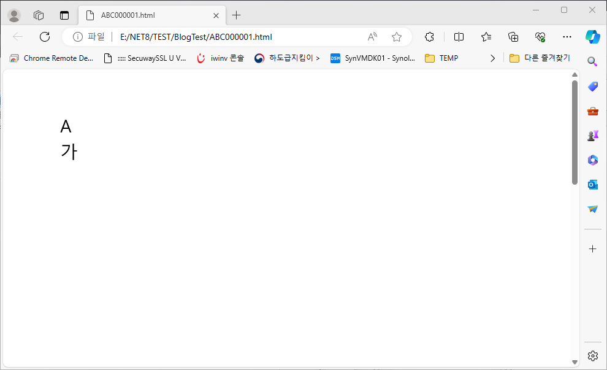

## Using Font in HTML-5 Canvas with GDI+ Graphics Path 

- [HTML Output](ABC000001.html)

    

### Converting GDI+ Graphics Path to HTML-5 Canvas Path

- Javascript function for character 'A'(F1) and '가'(F2) definition

    >function F1(_c){<br/>
    _c.beginPath();<br/>
    _c.moveTo(52,72);<br/>
    _c.bezierCurveTo(51,75,50,78,50,79);<br/>
    _c.lineTo(32,129);<br/>
    _c.lineTo(72,129);<br/>
    _c.lineTo(54,79);<br/>
    _c.bezierCurveTo(53,78,52,75,52,72);<br/>
    _c.lineTo(52,72);<br/>
    _c.closePath();<br/>
    _c.moveTo(46,59);<br/>
    _c.lineTo(58,59);<br/>
    _c.lineTo(102,172);<br/>
    _c.lineTo(88,172);<br/>
    _c.lineTo(76,140);<br/>
    _c.lineTo(27,140);<br/>
    _c.lineTo(16,172);<br/>
    _c.lineTo(2,172);v
    _c.lineTo(46,59);<br/>
    _c.lineTo(46,59);<br/>
    _c.closePath();<br/>
    }<br/>
    function F2(_c){<br/>
    _c.beginPath();<br/>
    _c.moveTo(20,50);<br/>
    _c.lineTo(89,50);<br/>
    _c.bezierCurveTo(88,93,66,126,22,151);<br/>
    _c.lineTo(13,142);<br/>
    _c.bezierCurveTo(29,135,43,125,55,110);<br/>
    _c.bezierCurveTo(68,96,75,79,77,61);<br/>
    _c.lineTo(20,61);<br/>
    _c.lineTo(20,50);<br/>
    _c.closePath();<br/>
    _c.moveTo(114,37);<br/>
    _c.lineTo(126,37);<br/>
    _c.lineTo(126,99);<br/>
    _c.lineTo(153,99);<br/>
    _c.lineTo(153,109);<br/>
    _c.lineTo(126,109);<br/>
    _c.lineTo(126,186);<br/>
    _c.lineTo(114,186);<br/>
    _c.lineTo(114,37);<br/>
    _c.lineTo(114,37);<br/>
    _c.closePath();<br/>
    }<br/>

- Javascript function for drawing characters to HTML BODY

    >function drawPage1() {<br/>
    cx.save();<br/>
    cx.translate(472,354);<br/>
    cx.strokeStyle='rgba(0,0,0,1)';<br/>
    cx.fillStyle='rgba(0,0,0,1)';<br/>
    cx.save();<br/>
    cx.translate(0,0);<br/>
    cx.translate(0,0);<br/>
    F1(cx);<br/>
    cx.fill();<br/>
    cx.restore();<br/>
    cx.restore();<br/>
    cx.save();<br/>
    cx.translate(472,590);<br/>
    cx.strokeStyle='rgba(0,0,0,1)';<br/>
    cx.fillStyle='rgba(0,0,0,1)';<br/>
    cx.save();<br/>
    cx.translate(0,0);<br/>
    cx.translate(0,0);<br/>
    F2(cx);<br/>
    cx.fill();<br/>
    cx.restore();<br/>
    cx.restore();<br/>
    }<br/>

```C#
public static void WriteGraphicsPath(StringBuilder lSB, string Ctx, PathData lPathD)
{
    try
    {
        HtmlPrint.beginPath(lSB, Ctx);
        PointF[] lptfaPathPoint = lPathD.Points;
        List<Point> llptCurveTo = new List<Point>();
        byte[] lbyaPathType = lPathD.Types;
        bool lbIsLastCommandCLOSEPATH = true;
        for (int idx = 0; idx < lptfaPathPoint.Length; idx++)
        {
            Point lPP = Point.Round(lptfaPathPoint[idx]);                    
            byte lPT = lbyaPathType[idx];
            if (llptCurveTo.Count == 3)
            {
                CurveTo(lSB, Ctx, llptCurveTo);
                llptCurveTo.Clear();
            }
            if (lPT >= 0x80)
            {
                if (llptCurveTo.Count == 0)
                {
                    HtmlPrint.lineTo(lSB, Ctx, lPP.X, lPP.Y);
                }
                else
                {
                    llptCurveTo.Add(lPP);
                    CurveTo(lSB, Ctx, llptCurveTo);
                    llptCurveTo.Clear();
                }
            }
            if (lPT == 0x00)    // Indicates that the point is the start of a figure.
            {
                if (!lbIsLastCommandCLOSEPATH)
                    HtmlPrint.closePath(lSB, Ctx);

                HtmlPrint.moveTo(lSB, Ctx, lPP.X, lPP.Y);
                lbIsLastCommandCLOSEPATH = false;
            }
            else if (lPT == 0x01)   // Indicates that the point is one of the two endpoints of a line.
            {
                HtmlPrint.lineTo(lSB, Ctx, lPP.X, lPP.Y);
                lbIsLastCommandCLOSEPATH = false;
            }
            else if (lPT == 0x03)   // Indicates that the point is an endpoint or control point of a cubic Bezier spline.
            {
                llptCurveTo.Add(lPP);
                lbIsLastCommandCLOSEPATH = false;
                //PS_LineTo(lFStream, lPP.X, lPP.Y);
            }
            else if (lPT == 0x07)   // Masks all bits except for the three low-order bits, which indicate the point type.
            {
                lbIsLastCommandCLOSEPATH = false;
            }
            else if (lPT == 0x20)   // Specifies that the point is a marker.
            {
                lbIsLastCommandCLOSEPATH = false;
            }
            else if (lPT == 0x80)   // Specifies that the point is the last point in a closed subpath (figure).
            {
                HtmlPrint.closePath(lSB, Ctx);
                lbIsLastCommandCLOSEPATH = true;
            }
            else if (lPT == 0x83)
            {
                HtmlPrint.closePath(lSB, Ctx);
                lbIsLastCommandCLOSEPATH = true;
            }
            else if (lPT == 0xa3)
            {
                HtmlPrint.closePath(lSB, Ctx);
                lbIsLastCommandCLOSEPATH = true;
            }
            else
            {
            }
        }
        if (llptCurveTo.Count == 3)
        {
            CurveTo(lSB, Ctx, llptCurveTo);
            llptCurveTo.Clear();

        }
        if (!lbIsLastCommandCLOSEPATH)
            HtmlPrint.closePath(lSB, Ctx);
    }
    catch (Exception lExe)
    {
        ORIONDEBUG.LOG(LogInfo.EnumLogLevel.ERROR, "HtmlPrint::WriteGraphicsPath()", lExe);
    }
}

public static void CurveTo(StringBuilder lSB, string Ctx, List<Point> llptCurveTo)
{
    if (llptCurveTo.Count == 2)
        HtmlPrint.quadraticCurveTo(lSB, Ctx, llptCurveTo[0].X, llptCurveTo[0].Y, llptCurveTo[1].X, llptCurveTo[1].Y);
    else if (llptCurveTo.Count == 3)
        HtmlPrint.bezierCurveTo(lSB, Ctx, llptCurveTo[0].X, llptCurveTo[0].Y, llptCurveTo[1].X, llptCurveTo[1].Y, llptCurveTo[2].X, llptCurveTo[2].Y);
}

...

public static void beginPath(StringBuilder lSB, string Ctx)
{
    lSB.Append(Ctx + ".beginPath();\n");
}
public static void closePath(StringBuilder lSB, string Ctx)
{
    lSB.Append(Ctx + ".closePath();\n");
}
//quadraticCurveTo(cp1x, cp1y, x, y)
public static void quadraticCurveTo(StringBuilder lSB, string Ctx, int cp1x, int cp1y, int x, int y)
{
    lSB.Append(Ctx + ".quadraticCurveTo(" + cp1x + "," + cp1y + "," + x + "," + y + ");\n");
}
//bezierCurveTo(cp1x, cp1y, cp2x, cp2y, x, y)
public static void bezierCurveTo(StringBuilder lSB, string Ctx, int cp1x, int cp1y, int cp2x, int cp2y, int x, int y)
{
    lSB.Append(Ctx + ".bezierCurveTo(" + cp1x + "," + cp1y + "," + cp2x + "," + cp2y + "," + x + "," + y + ");\n");
}
//moveTo(x, y)
public static void moveTo(StringBuilder lSB, string Ctx, int x, int y)
{
    lSB.Append(Ctx + ".moveTo(" + x + "," + y + ");\n");
}
//lineTo(x, y)
public static void lineTo(StringBuilder lSB, string Ctx, int x, int y)
{
    lSB.Append(Ctx + ".lineTo(" + x + "," + y + ");\n");
}
```

