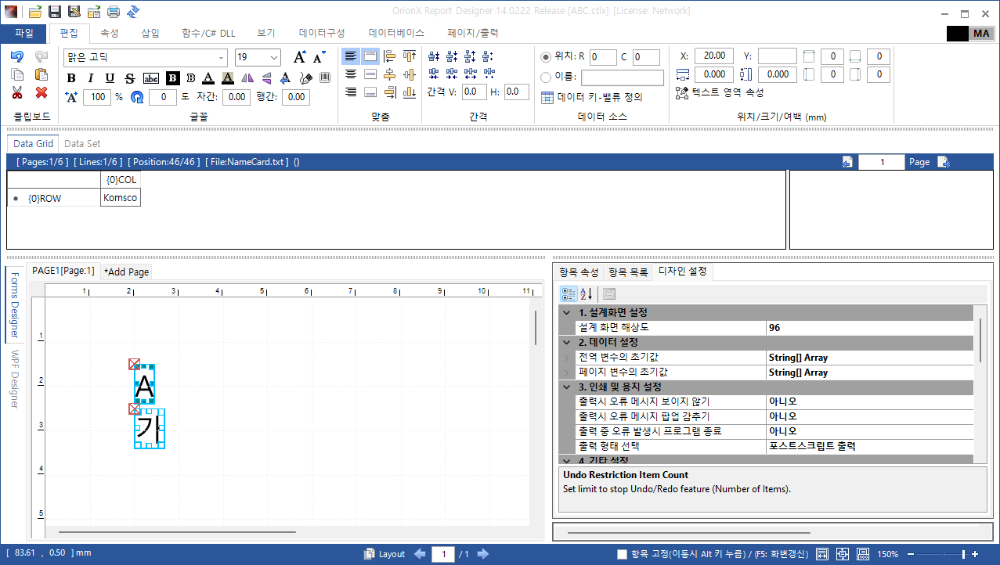

## Overview

Orion Report Designer supports various output formats including PDF, PostScript, HTML-5, Images(png, jpg, tiff, bmp) and also supports WPF, WinForms, Web design user interfaces.
Each output handles text fonts in different ways, 

- WPF supports TTF(TreuType Font) and OTF(OpenType Font)
- WinForms only supports TTF
- PostScript supports PS specific fonts which are not compatible with other output formats
- HTML supports TTF/OTF, WOFF, WOFF2

Drawing the exactly same text in different output formats is a key issue. 

So, for the unified way of drawing texts in PDF, PostScript, HTML-5 Canvas, WPF and WinForms, WPF font geometry would be a good choice. WPF can extract font geometry from TTF/OTF font files and WPF geometry can be converted to GDI+ Graphics Path. GDI+ Graphics Path also converted to PostScript path and HTML-5 Canvas Path. 

Using path based text presentation requires some tricks for better speed and smaller outputs.

- WPF Geometries/GDI+ graphics pathes should be cached
    - Extracting geometry from font file and converion takes time
- PostScript and HTML-5 Canvas font pathes should be reused
    - In PostScript, once a character is used, put its path into the header of PS file then call the definition when reuse the character
    - In HTML, the path of a character is defined as a function at the top of JavaScript, then the function is called where the character appears
- PostScript header and body should be compressed
- To support extended font styles like reverse-order, flips(horizontally, vertically), width-height ratio, outlined, character gap, line gap all output formats should have commands for transforming the pathes 

- Web Version of Designer UI

    

- WPF Version of Designer UI

    

- WinForms Version of Designer UI

    

