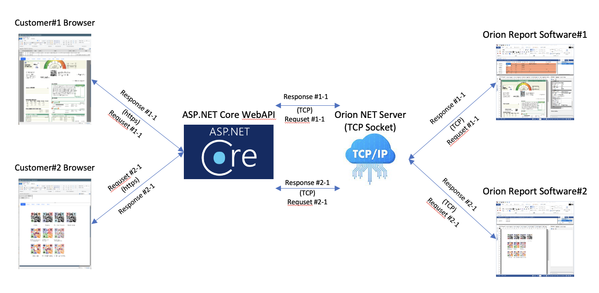
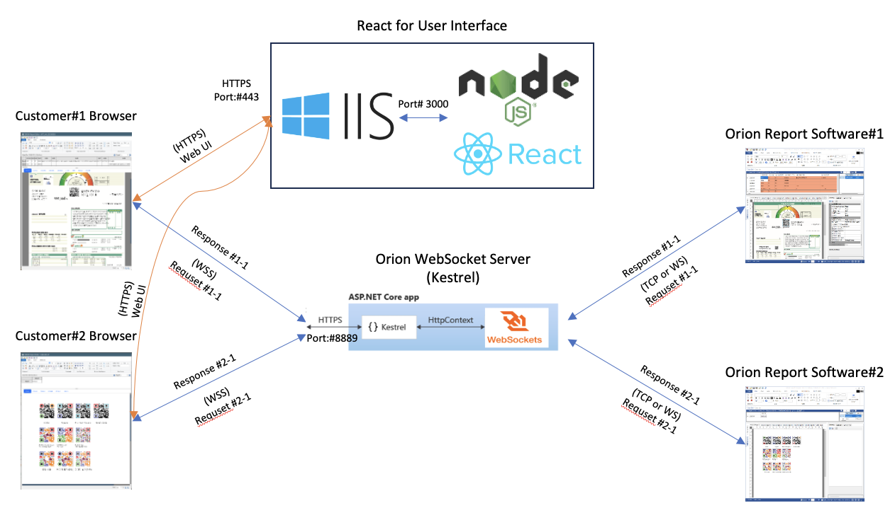

## Overview

For years, the development of a new web-based user interface for the Orion Report Editor has been in progress. Orion itself features the ability to create HTML5-Canvas (JavaScript) outputs, but these outputs are static HTML pages. The Web Editor module was originally developed in 2017 using ASP.NET WebAPI (.NET Framework) and JavaScript. In late 2023, it was redesigned with ASP.NET Core WebAPI (.NET 8) and React/TypeScript.

In March 2024, I am integrating Orion's Web Editor module into a customer's environment, and the WebAPI has been replaced with WebSocket.

- The Web Editor needs to be embedded into the customer's shopping mall site, which is hosted on the Cafe24 shopping mall services.
- The Web Editor will be a part (Modal or Frame) of Cafe24's product page, using IFRAME or EMBED tags.
- SSL (HTTPS, WSS) is required.

****

- Orion Web Editor with WebAPI 
    

*****

- Orion Web Editor with Kestrel and WebSocket 
    

****

## IIS vs Kestrel for HTTPS and WSS

### IIS and Backend Services

Initially, I configured the SSL WebSocket service through IIS because IIS handles the SSL certificate and connections from browsers. However, it did not work as I tested in the development environment using Kestrel. With IIS, the backend TCP socket server was very unstable, and I couldn't determine the cause. I suspect that the threading of the IIS worker process might have affected it.

### Kestrel with SSL Certificate

All my ASP.NET apps are running on Windows, so until now, IIS has handled all HTTP/HTTPS connections. I've never configured SSL for an ASP.NET app with Kestrel. Here are the steps to configure Kestrel SSL services.

- Development Environment

    - [Create Self-signed certificate for localhost SSL](https://learn.microsoft.com/en-us/dotnet/core/additional-tools/self-signed-certificates-guide#create-a-self-signed-certificate)
        > dotnet dev-certs https -ep $env:USERPROFILE\.aspnet\https\localhost.pfx -p PASSWD<br/>
        > dotnet dev-certs https --trust
    - [Kestrel endpoint configuration](https://learn.microsoft.com/en-us/aspnet/core/fundamentals/servers/kestrel/endpoints?view=aspnetcore-8.0) for development/debug.
        
        ```CSharp
        public static void Main(string[] args)
        {
            int httpsPort = ServerCfg.WebSocketPort;
            int httpPort = ServerCfg.OrionWebSocketPort;

            Host.CreateDefaultBuilder(args)
                .ConfigureWebHostDefaults(webBuilder =>
                {
                    webBuilder.ConfigureKestrel(serverOptions =>
                    {
                        serverOptions.Listen(IPAddress.Any, httpPort);
                        serverOptions.ListenAnyIP(httpsPort, listenOptions =>
                        {
                            listenOptions.UseHttps(httpsOptions =>
                            {
                                var localhostCert = CertificateLoader.LoadFromStoreCert(
                                    "localhost", "My", StoreLocation.CurrentUser,
                                    allowInvalid: true);
                                var certs = new Dictionary<string, X509Certificate2>(StringComparer.OrdinalIgnoreCase)
                                    {
                                        { "localhost", localhostCert },
                                    };

                                httpsOptions.ServerCertificateSelector = (connectionContext, name) =>
                                {
                                    if (name != null && certs.TryGetValue(name, out var cert))
                                    {
                                        return cert;
                                    }

                                    return localhostCert;
                                };
                            });
                        });

                    });
                    webBuilder.UseStartup<Startup>();
                })
                .Build()
                .Run();
        }
        ```


- Production Configuration

    - Purchase an SSL certificate and convert it to a .pfx file.

    - Configure SSL (assuming the certificate's .pfx file is located in the same folder as the execution assembly).
    
        ```CSharp
        ...
        serverOptions.Listen(IPAddress.Any, httpPort);
        serverOptions.ListenAnyIP(httpsPort, listenOptions =>
        {
            listenOptions.UseHttps(httpsOptions =>
            {
                string curAssemblyPath = new System.Uri(System.Reflection.Assembly.GetExecutingAssembly().Location).LocalPath;
                string assemblyFolder = Path.GetDirectoryName(curAssemblyPath);
                string certPath = Path.Combine(assemblyFolder, "webedit01.oryonsoft.com.pfx");
                listenOptions.UseHttps(certPath, "PASSWD");
            });
        });
        ...
        ```

## WebSocket in .NET

There is a well-designed [WebSocket Server/Client Sample](https://github.com/MV10/WebSocketExample), and I modified it for my project.

### Reconnecting WebSocket Client Library

ASP.NET Core supports [WebSocket](https://learn.microsoft.com/en-us/dotnet/api/microsoft.aspnetcore.websockets?view=aspnetcore-8.0) and there is a TypeScript library([Reconnecting WebSocket](https://github.com/pladaria/reconnecting-websocket)) featuring automatic reconnection when the connection is lost.  

### Send Data Timeout and Callback

There are two types of messages: one-way and round-trip. To verify that a message has arrived at Orion and that the response is received within the timeout period, the Message Handler class keeps track of each message, including handling message timeouts. Every message sent to the Orion Report Server receives a response to confirm that the message was processed by Orion.

- MessageHandler Class

    ```TypeScript
    export class MessageHandler {
        reconnWebSock: ReconnectingWebSocket;
        msgID: number;
        resultCallback: (result: ApiResult) => void | null;
        timeSpan: TimeSpan;
        timeoutMS: number;
        timeoutID: any;
        retryCount: number;
        retryMax: number;
        data: string;
        timeoutCallback: (event: MessageEvent) => void | null;
        result: ApiResult | null;
        success: boolean;
        isDisposed: boolean;

        constructor(reconnWebSock: ReconnectingWebSocket, msgID: number, resultCallback: (result: ApiResult) => void,
            timeoutMS: number, data: string, timeoutCallback: (event: MessageEvent) => void | null) {
            this.reconnWebSock = reconnWebSock;
            this.msgID = msgID;
            this.resultCallback = resultCallback;
            this.timeSpan = TimeSpan.zero;
            this.timeoutMS = timeoutMS; // 0 = no timeout
            this.retryCount = 0;
            this.retryMax = 3;
            this.data = data;
            this.timeoutCallback = timeoutCallback;
            this.result = null;
            this.success = false;
            this.isDisposed = false
            //
            this.dispose = this.dispose.bind(this);
            this.timerTick = this.timerTick.bind(this);
            //
            this.timeoutID = null;
            if (this.timeoutMS > 0) {
                this.timeoutID = setTimeout(this.timerTick, this.timeoutMS);
            }

        }

        dispose() {
            this.isDisposed = true;
            if (this.timeoutID !== null) {
                clearTimeout(this.timeoutID);
            }
        }

        timerTick() {
            this.retryCount++;
            if (this.retryCount < this.retryMax) {
                this.timeoutID = setTimeout(this.timerTick, this.timeoutMS);
            } else {
                if (this.timeoutCallback) {
                    const apiResult: ApiResult = new ApiResult();
                    apiResult.msgID = this.msgID;
                    apiResult.success = false;
                    apiResult.message = `Sending msgID: ${this.msgID} exceeded retry count. data = ${this.data}`;
                    const msgEvent: MessageEvent = new MessageEvent('timeout', { data: JSON.stringify(apiResult) });
                    this.timeoutCallback(msgEvent);
                }
                this.dispose();

            }
        }
    }
    ```


- One way message
    - No 

- Round trip message


