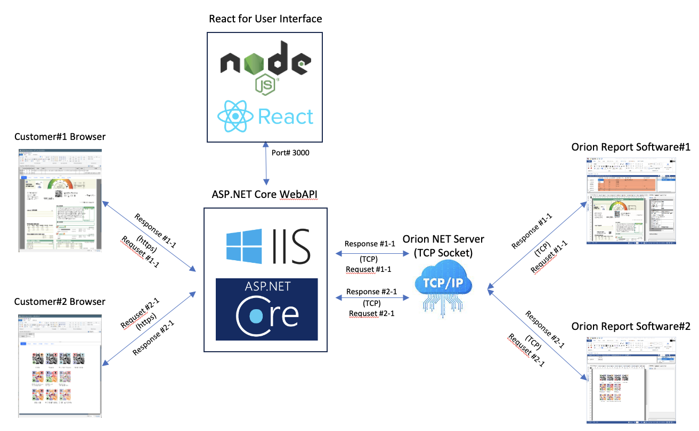

## Overview

For years, the development of a new web-based user interface for the Orion Report Editor has been in progress. Orion itself features the ability to create HTML5-Canvas (JavaScript) outputs, but these outputs are static HTML pages. The Web Editor module was originally developed in 2017 using ASP.NET WebAPI (.NET Framework) and JavaScript. In late 2023, it was redesigned with ASP.NET Core WebAPI (.NET 8) and React/TypeScript.

In March 2024, I am integrating Orion's Web Editor module into a customer's environment, and the WebAPI has been replaced with WebSocket.

- The Web Editor needs to be embedded into the customer's shopping mall site, which is hosted on the Cafe24 shopping mall services.
- The Web Editor will be a part (Modal or Frame) of Cafe24's product page, using IFRAME or EMBED tags.
- SSL (HTTPS, WSS) is required.

****

- Orion Web Editor with WebAPI 
    

*****

- Orion Web Editor with Kestrel and WebSocket 
    

****

## IIS vs Kestrel for HTTPS and WSS

### IIS and Backend Services

Initially, I configured the SSL WebSocket service through IIS because IIS handles the SSL certificate and connections from browsers. However, it did not work as I tested in the development environment using Kestrel. With IIS, the backend TCP socket server was very unstable, and I couldn't determine the cause. I suspect that the threading of the IIS worker process might have affected it.

### Kestrel with SSL Certificate

## WebSocket in .NET

### Reconnecting WebSocket Library

ASP.NET Core supports [WebSocket](https://learn.microsoft.com/en-us/dotnet/api/microsoft.aspnetcore.websockets?view=aspnetcore-8.0) and there is a TypeScript library([Reconnecting WebSocket](https://github.com/pladaria/reconnecting-websocket)) featuring automatic reconnection when the connection is lost.  

I chose Reconnection WebSocket and 

